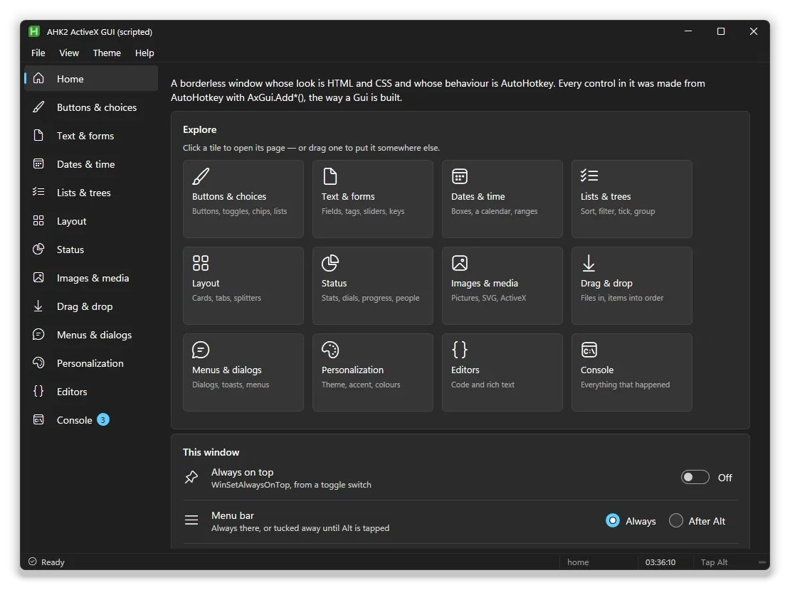
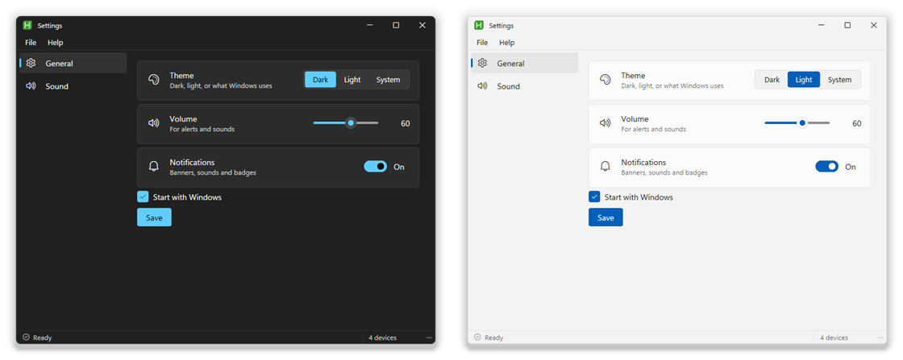
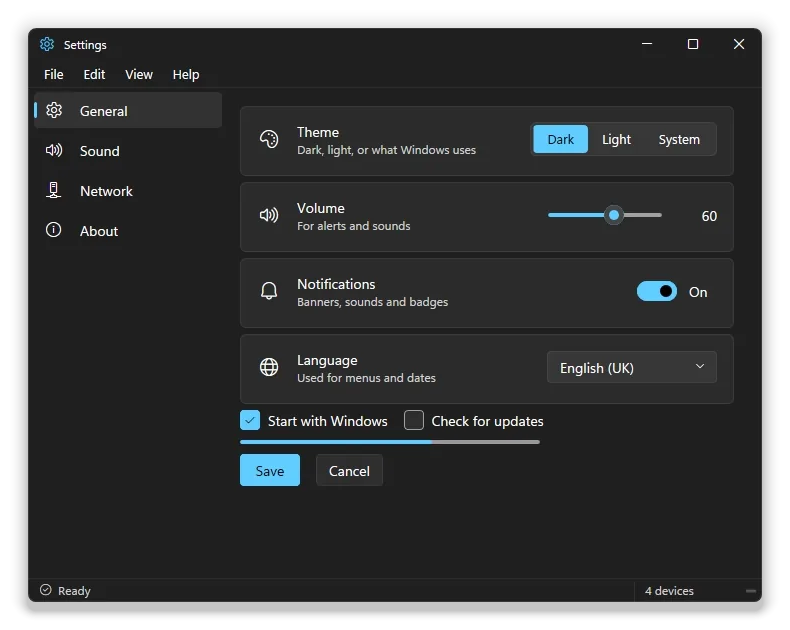
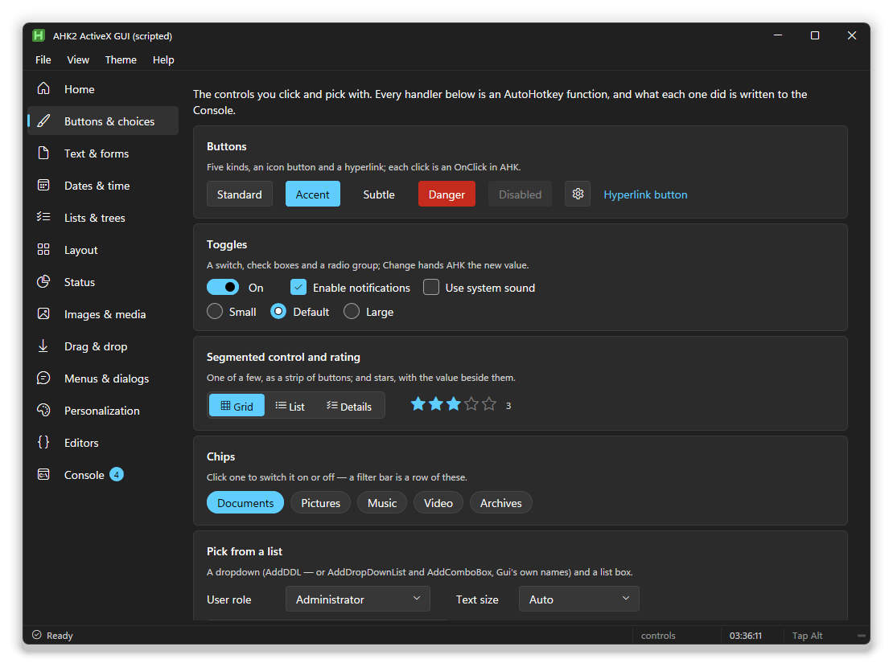
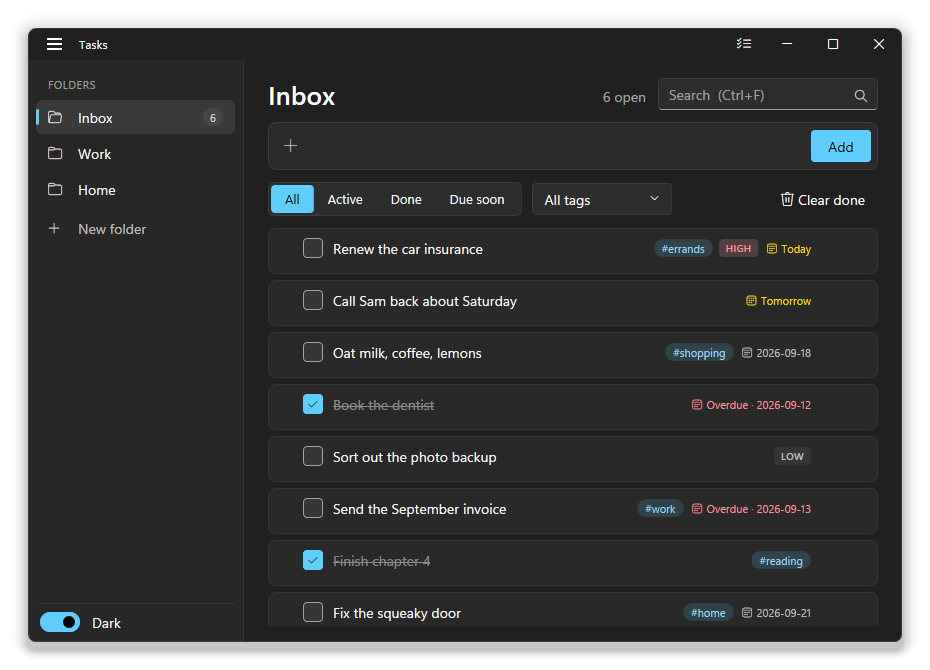
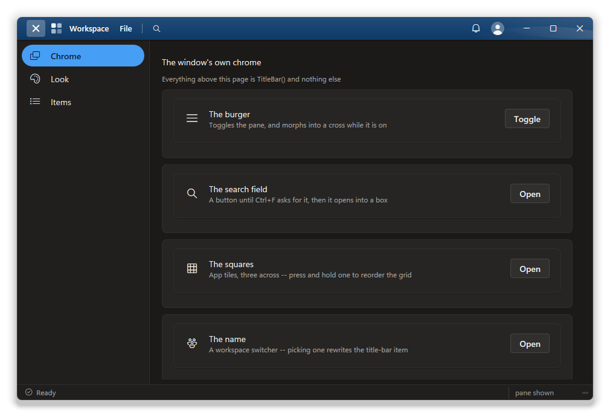
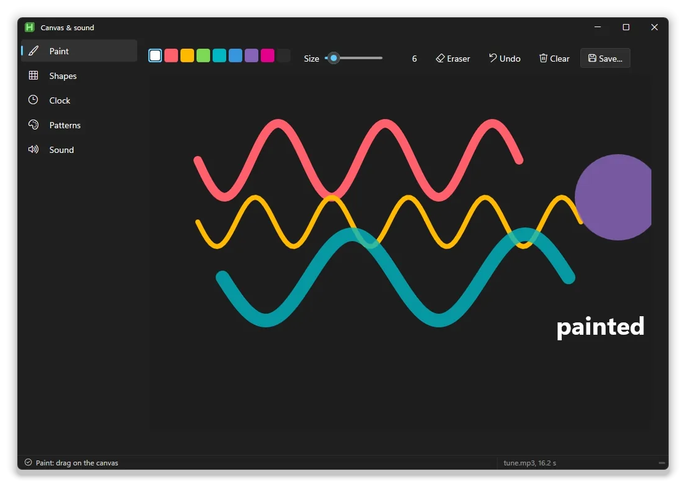
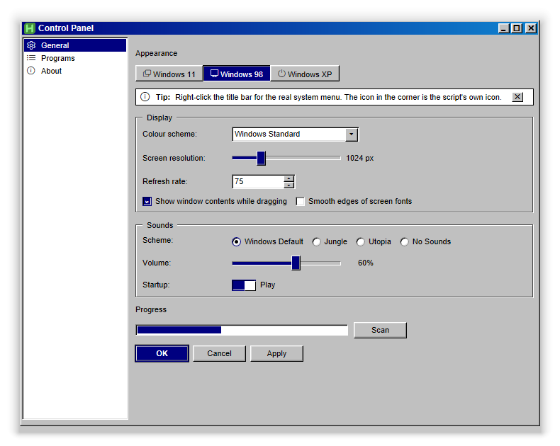
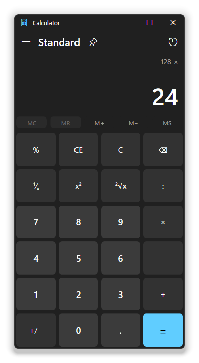

# AHK2 ActiveX GUI

**Good-looking windows for AutoHotkey v2.** You build them the way you build a
`Gui`, with `Add*` calls, events and `.Value`. They come out looking like
Windows 11, or one of eleven other styles, and they switch between dark and
light on their own.



Under the hood each window is borderless, and its contents are HTML and CSS
drawn by the Internet Explorer engine that every copy of Windows 10 and 11
still has. You don't write HTML or JavaScript, though: every click and change
arrives in your AutoHotkey code.

## Quick start

Download or clone this repository, then put a script next to the `lib` folder:

```ahk
#Requires AutoHotkey v2.0
#Include lib\AxGui.ahk

g := AxGui({Title: "Settings", Width: 720, Height: 560, Theme: "dark"})
g.AddMenuBar([{Title: "&File", Items: [["&Open", (*) => 0]]}, {Title: "&Help", Items: [["&About", (*) => 0]]}])
g.AddStatusBar([{Id: "msg", Text: "Ready", Icon: "E930", Grow: true}, {Id: "n", Text: "4 devices", Width: 110}])

g.AddPage("general", "General", "E713")
g.AddRow("Icon=E790", "Theme", "Dark, light, or what Windows uses")
g.AddSegmented("vtheme Choose1", "dark:Dark|light:Light|system:System")
    .OnChange((ctl, value, *) => g.SetTheme(value))
g.Use()
g.AddRow("Icon=E767", "Volume", "For alerts and sounds")
g.AddSlider("w170", 60)
g.Use()
g.AddRow("Icon=EA8F", "Notifications", "Banners, sounds and badges")
g.AddSwitch("Checked")
g.Use()
g.AddCheckBox("Checked", "Start with Windows")
g.AddButton("Accent", "Save").OnEvent("Click", (*) => g.Toast("Saved"))

g.AddPage("sound", "Sound", "E767")
g.Show()
```



The four-character codes (`E713`, `E790`...) are icons from the Segoe Fluent
Icons font that ships with Windows. The option strings (`vName`, `w170`,
`Checked`, `Choose1`) mean what they mean in `Gui.Add`.

**New to it?** [The guide](docs/guide.md) takes you from here to menus,
dialogs, lists, drag and drop and a single `.exe`.

## Twelve looks, dark and light

One line, `Stylesheet: "win98"`, changes the whole look. `g.SetStylesheet()`,
`g.SetTheme("light")` and `g.SetAccent("#c239b3")` change it while the window
is open.



Windows 11, Microsoft 365, Windows 98, Windows XP, Aurora, Cozy, Cyber,
Parchment (`rpg`), Instrument, Precision, Inset and Brutalist.
[See them all side by side](docs/themes.md), with what makes each one
different and how to write your own.

## What you get

- **Every control a `Gui` has**, drawn the Windows 11 way: buttons, edits,
  check boxes, radios, drop-downs, list boxes, sliders, progress bars, tabs,
  `ListView` and `TreeView` with AutoHotkey's own methods.
- **More than a `Gui` has:** switches, setting rows, cards, expanders, chips,
  ratings, date pickers and calendars, tag boxes, charts, gauges, stat cards,
  a data grid with sorting, filtering and grouping, a code editor, a rich text
  editor, a colour picker, a canvas to draw and animate on, an audio player, and a small
  game engine: low-poly 3D, or top-down 2D with tiles and pixel-art sprites.
- **The window around it:** menu bar, status bar, a title bar you can put
  your own buttons, search box and menus in, context menus, dialogs, toasts,
  Windows notifications, drag and drop from Explorer, Snap Layouts.
- **Native controls inside the page:** a web browser, a video player, any
  ActiveX control.
- **One `.exe`:** compile with Ahk2Exe and the themes and icons go inside it.
- **A designer.** AxStudio lets you drag controls onto a window and exports
  the script (see [below](#the-studio)).

## Examples

Run any file in `example\` with AutoHotkey v2.

<table>
<tr>
<td width="50%"><br><b>Showcase.ahk</b>: every control and component, page by page</td>
<td width="50%"><br><b>Todo.ahk</b>: a to-do list with folders, tags and due dates, saved to an ini</td>
</tr>
<tr>
<td><br><b>Titlebar.ahk</b>: a window whose title bar holds a burger, a search box and pop-overs</td>
<td><br><b>Editors.ahk</b>: the code editor and the rich text editor</td>
</tr>
<tr>
<td><br><b>Game.ahk</b>: Gem Rush, a low-poly 3D game on the built-in engine, with a live debug panel</td>
<td><br>The same game with its colliders showing, and the engine's numbers</td>
</tr>
<tr>
<td><br><b>Quest</b> (a studio template): a small top-down adventure, its hero's stats bound to the panel</td>
<td><br>The hero and the quest are values with fields, listed in the studio's Logic tab</td>
</tr>
<tr>
<td><br><b>Canvas.ahk</b>: painting, shapes you drag and animate, a clock, spirographs and a music player</td>
<td><br>The same example's shapes, animated from AutoHotkey</td>
</tr>
<tr>
<td><br><b>Retro.ahk</b>: Windows 98, XP and 11, switched live</td>
<td><br><b>ColorPicker.ahk</b>: the colour picker as a button, a dialog and inline</td>
</tr>
</table>



Also in the folder:

- **Calculator.ahk**: the Windows 11 calculator, rebuilt (right).
- **Embed.ahk**: a web browser, a video player and a document viewer docked
  inside the page.
- **Transparent.ahk**: window opacity, shaped windows and a see-through
  overlay.

<br clear="right">

## The studio

`studio\AxStudio.ahk` is a designer for these windows, built with the same
library. Drag controls onto a canvas, wire them up without code (or with it),
press **F5** to run the result, and export a plain `.ahk` script.


```bash
"C:\Program Files\AutoHotkey\v2\AutoHotkey64.exe" studio\AxStudio.ahk
```

The [studio manual](docs/studio.md) covers the canvas, binding controls to
values (including values with fields, like a game character's), rules, the
step-by-step editor, and importing an existing `Gui` script. Its **Quest**
template is [a small adventure game](docs/studio.md#a-game-in-the-studio) made
of exactly those parts.

## Documentation

| | |
|---|---|
| [Guide](docs/guide.md) | Building a window: controls, layout, events, menus, dialogs, compiling |
| [Components](docs/components.md) | The big controls: data grid, list and tree views, code and rich text editors, colour picker, canvas, audio, the game engine |
| [Themes](docs/themes.md) | The twelve stylesheets, accents and tints, and writing your own |
| [Reference](docs/reference.md) | Every option, method, event and tag in one place |
| [Studio](docs/studio.md) | The AxStudio manual |
| [Inspector](docs/inspector.md) | A DevTools-style inspector for your window: press F12 |
| [Generated code](docs/generated-code.md) | What a script exported from the studio looks like |
| [Extending](docs/extending.md) | Adding a control, a component, a theme or a template |
| [Architecture](docs/architecture.md) | How the pieces fit together, and what happens under the hood |

## Requirements

- AutoHotkey v2.0 or later.
- Windows 10 or 11. The Internet Explorer engine the windows use is part of
  Windows even where the Internet Explorer browser is not.

The library switches the engine into its modern (IE11) mode for your script by
itself, per user. `tools\RegisterBrowserEmulation.ahk /machine` does it for
every user instead.

## What's where

| | |
|---|---|
| `lib\AxGui.ahk` | The one file you include |
| `version.json` | This release: AxGui 1.0, AxStudio 0.9. The studio's **Help > Check for updates** reads it from GitHub |
| `lib\components\` | Every control, one folder each |
| `lib\themes\` | The stylesheets |
| `lib\dev\AxInspector.ahk` | The F12 inspector (left out of compiled exes) |
| `example\` | The examples above |
| `studio\` | AxStudio |
| `docs\` | This documentation |
