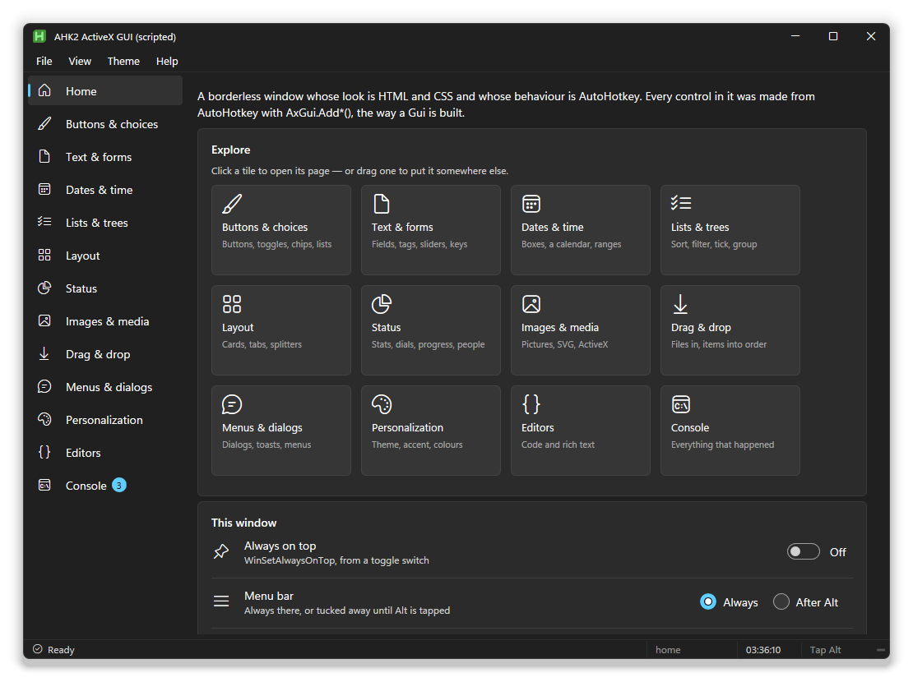

# Documentation

**Using the library**

| | |
|---|---|
| [Guide](guide.md) | Start here. Controls, layout, events, menus, dialogs, drag and drop, one `.exe` |
| [Components](components.md) | The data grid, list and tree views, code and rich text editors, colour picker, dates, charts, canvas, audio, a game engine |
| [Themes](themes.md) | The twelve looks, accent and tint, writing your own stylesheet |
| [Reference](reference.md) | Every option, method, event and tag |
| [Inspector](inspector.md) | Press F12 on your window to see what's going on |

**Using the designer**

| | |
|---|---|
| [Studio](studio.md) | The AxStudio manual |
| [Generated code](generated-code.md) | What an exported script looks like, and editing it by hand |

**Working on the code**

| | |
|---|---|
| [Architecture](architecture.md) | How the library and the studio fit together, and what happens under the hood |
| [Extending](extending.md) | Adding a component, a theme, a template, an action or a rule |
| [lib/components](../lib/components/README.md) | What goes in a component's folder |

The screenshots are real windows, taken from the examples in `example\` and
from the studio.
