# Components

The bigger controls: the ones that are more than a box and less than an app.
You add them with an `Add*` call like any other control, and `ctl.Component`
gives you the object behind them, with its own methods and events.

- [Data view](#data-view): a list, a tree and a grouped table in one
- [List view and tree view](#list-view-and-tree-view): AutoHotkey's own, with their own methods
- [File view](#file-view): a file window in parts, over the disk, the registry, a zip or nothing at all
- [Ribbon](#ribbon): tabs over grouped panels, one line, a strip, or tabs in the title bar
- [Code editor](#code-editor)
- [Rich text editor](#rich-text-editor)
- [Colour picker](#colour-picker)
- [Dates and times](#dates-and-times)
- [Charts, gauges and stat cards](#charts-gauges-and-stat-cards)
- [Canvas](#canvas): draw, animate, drag, paint
- [Audio](#audio): play MP3s and control them from code
- [Game engine](#game-engine): low-poly 3D or top-down 2D with tiles and sprites, the rules in your script
- [Splitter](#splitter)
- [Writing your own](#writing-your-own)

A window only carries the stylesheet of a component it actually uses.

## Data view

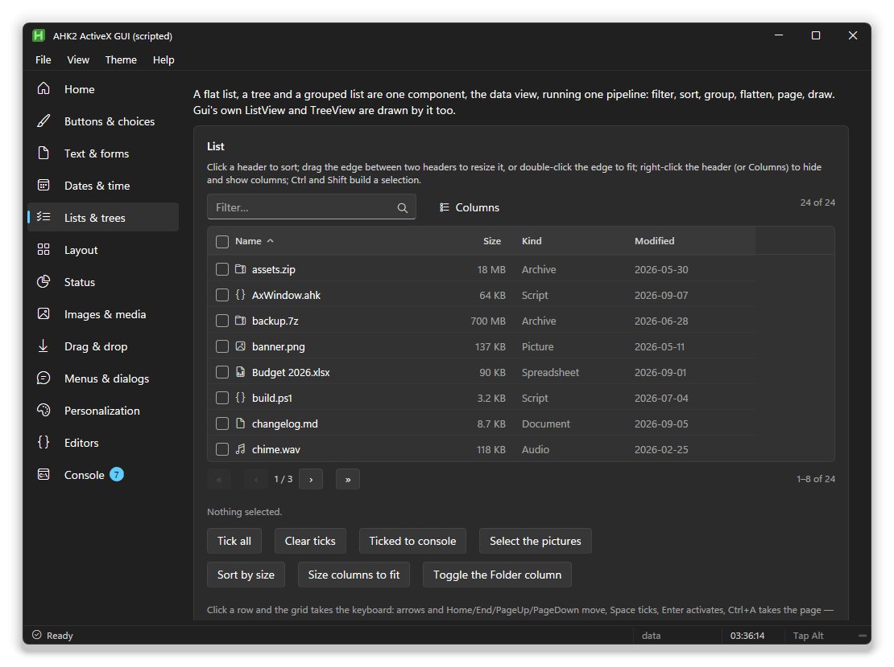

```ahk
dv := g.AddDataView("vfiles Fill h340 Checkboxes PageSize=25", {
    Columns: [{Key: "name", Title: "Name", Width: 260, Icon: true},
              {Key: "size", Title: "Size", Width: 100, Align: "right", Sort: "number",
               Format: (v, row) => AxWindow.FileSize(v)},
              {Key: "kind", Title: "Kind", Width: 140}],
    Rows: [{Key: "a", name: "readme.md", size: 1240, kind: "Document"},
           {Key: "b", name: "photo.jpg", size: 845000, kind: "Picture"}]})
dv.Component.OnSelect((rows, *) => ToolTip(rows.Length " selected"))
```

What the user can do:

- **Sort** by clicking a header, and **resize** by dragging the edge between
  two headers. Double-click that edge to fit the column to its contents.
- **Filter** with the search box, across every column.
- **Hide and show columns** from the header's right-click menu.
- **Use the keyboard**: arrows, Home/End, Page Up/Down, Space to tick,
  Enter to open, Ctrl+A for everything, Left and Right to fold a tree. Typing
  jumps to the first row that starts with what you typed.

What you can do:

- **A tree**: give rows `Children`. Filtering opens the branches down to a match.
- **Groups**: `Group: "kind"` (or a function) gives collapsible group headers with counts.
- **Tick boxes**: `Checkboxes`, with `CheckMode: "row"` to tick by clicking
  anywhere on the row, and `CheckTree` so ticking a branch ticks what's under it.
- **Selection**: `Select` is `"multi"` (the default), `"single"` or `"none"`.

| | |
|---|---|
| Options | `Columns`, `Rows`, `Tree`, `Group`, `PageSize`, `Select`, `Checkboxes`, `CheckMode`, `CheckTree`, `CheckAll`, `Search`, `Tools`, `ColumnMenu`, `Sort`, `Empty`, `FilterFn`, `TypeToFind` |
| In the option string | `Single`, `NoSelect`, `Checkboxes`, `CheckRow`, `CheckTree`, `NoCheckAll`, `Tree`, `NoSearch`, `NoTools`, `NoColumnMenu`, `PageSize=25`, `Group=kind` |
| Column fields | `Key`, `Title`, `Width`, `Align`, `Sort` (`true`, `"text"`, `"number"` or a function), `Format`, `Icon`, `Hidden`, `Hideable` |
| Events | `OnSelect(rows)`, `OnCheck(rows)`, `OnActivate(row)`, `OnSort(key, dir)`, `OnPage(n)`, `OnExpand(row, open)` |
| Methods | `SetRows`, `Reload`, `SetColumns`, `Filter`, `SortBy`, `GoPage`, `ExpandAll`, `CollapseAll`, `Selected`, `SelectedKeys`, `SelectKeys`, `ClearSelection`, `CheckAll`, `CheckedRows`, `CheckedKeys`, `ShowColumn`, `HideColumn`, `AutoSize`, `AutoSizeAll`, `Focus` |

`ctl.Value` is the selected keys, so `OnChange` works as it does on any
control. `Reload(rows)` is `SetRows` for rows that changed in place: the
selection, ticks and open branches stay where they were.

## List view and tree view

AutoHotkey's own `ListView` and `TreeView`, with the same methods and events,
drawn as a data view. A script written for `Gui` fills them unchanged, and
they sort, filter and tick like any data view.

```ahk
lv := g.AddListView("vfiles w420 h260 Checked", ["Name", "Size"])
lv.Add(, "readme.md", 1240)
lv.ModifyCol(2, "Integer")
lv.OnEvent("DoubleClick", (lv, row) => MsgBox(lv.GetText(row)))

tv := g.AddTreeView("vtree w260 h300")
fruit := tv.Add("Fruit")
tv.Add("Apple", fruit), tv.Add("Pear", fruit, "Select")
```

**List view:** `Add`, `Insert`, `Modify`, `Delete`, `GetCount`, `GetNext`,
`GetText`, `ModifyCol`, `InsertCol`, `DeleteCol`. **Tree view:** `Add`,
`Modify`, `Delete`, `GetSelection`, `GetParent`, `GetChild`, `GetNext`,
`GetPrev`, `GetText`, `Get`. **Events:** `Click`, `DoubleClick`,
`ItemSelect`, `ItemCheck`, `ItemFocus`, `ColClick`, `ItemExpand`,
`ContextMenu`. **Options:** `Checked`, `-Multi`, `Grid`, `NoSortHdr`, `-Hdr`,
`Sort`, `SortDesc`, plus `Search`, `PageSize=N`, `CheckTree`, and `Expanded`
for a tree.

A few extras save a lot of code: `RemoveSelected()`, `TickAll(on)`,
`Clear()`, `ToText()` / `FromText(text)`, `SaveTo(path)` / `LoadFrom(path)`
and `FillFolder(dir, pattern)`.

Both also accept plain text. For a list view, the first line is the column
titles and each line after it a row, with cells split by `|`. For a tree
view, one item per line, indented under its parent. `[x] ` at the start of a
line ticks it.

## File view

```ahk
st := AxFileState({Name: "files", Source: AxFileLocal(A_MyDocuments)})

g.AddFileTools("State=files")          ; back, forward, up, search, the knobs
g.AddFilePath("State=files")           ; breadcrumbs, or a path box
g.AddFileTree("w220 State=files")      ; the folders
g.AddFileView("Fill State=files")      ; the files
g.AddFilePreview("w300 State=files")   ; what the one you picked is
g.AddFileStatus("State=files")         ; how many, how big
```

or, for the usual arrangement without the argument:

```ahk
g.AddFileExplorer("Fill h420 Preview=300", {Source: AxFileLocal()})
```

One idea runs through it: a **state** knows where you are and what you are
looking at, and the **parts** draw it. The parts never talk to each other and
none of them owns the state, so you can use one of them, or all six, or write
a seventh, and the rest carry on. `example/Files.ahk` shows every shape of it.

### Where the files come from

A **source** answers a handful of questions about a tree of things that have
names, and the view asks nothing else — which is why the same view draws your
disk, a made-up drive, the registry and the inside of a `.zip`.

| | |
|---|---|
| `AxFileLocal(root := "")` | the disk. No root starts at the drives, each carrying its label, capacity and how full it is |
| `AxFileVirtual(tree, opts)` | a tree you hand it: invented, fetched from an API, or cached |
| `AxFileReg(root := "")` | the registry. Keys list as folders, values as files. Read only |
| `AxFileZip(path)` | inside an archive, through the shell's own reader |

Writing one is `List(path)` and, if its paths are not separated the way the
default expects, `Parent` and `Join`. Everything else — `Crumbs`, `Branches`,
`Item`, `Exists` — already has a sensible version.
`lib/components/FileSource/AxFileSource.ahk` states the whole contract at the
top of the file.

An item is `{Key, Name, Path, Kind, Icon, Size, Modified, Type, Hidden, Kids,
Data}` plus **anything else you put on it**, which a column can then show. A
source that knows about owners, ratings or play counts simply says so.

### The state

```ahk
st.Go(path)   st.Back()   st.Forward()   st.Up()   st.Home()   st.Refresh()
st.SetMode("details" | "list" | "tiles" | "icons" | "thumbs")
st.SetSort(key, dir?)   st.SetGroup(key)   st.SetFilter(text)
st.Show("hidden" | "checks" | "tree" | "preview", on)   st.Toggle("hidden")
st.IconSize(96)   st.SelectAll()   st.Invert()   st.Selected()   st.Checked()
st.SetSource(AxFileZip("backup.zip"))        ; the whole view, somewhere else
```

Events: `OnPath`, `OnItems`, `OnSelect`, `OnActivate`, `OnCheck`, `OnEdit`,
`OnDrop`, `OnMenu`, `OnError`, `OnMode`.

Ticking is not selecting: you tick a set to act on and you select to look at,
and `OnCheck` and `OnSelect` are two events.

### The columns

A column says what to read and how to draw it:

```ahk
{Key: "used",   Title: "Space", Width: 160, Render: "bar", Max: 100,
 Format: (v, it, st) => AxWindow.FileSize(it.Free) " free",
 Color:  (v, it, st) => (v > 90) ? "#e57373" : ""}
{Key: "rating", Title: "Rating", Width: 110, Render: "rating", Edit: true}
{Key: "tags",   Title: "Tags",   Width: 180, Render: "chips"}
{Key: "note",   Title: "Note",   Width: 200, Edit: "text"}
{Key: "kind",   Title: "Kind",   Width: 130, Html: (it, c, st) => "<b>…</b>"}
```

`Render` is one of `name`, `text`, `size`, `date`, `bar`, `progress`,
`rating`, `chips`, `swatch`, `toggle`, `spark`, `icon`, `path`. `Edit` is
`true` or `"text" | "number" | "rating" | "choice"` (with `Options`) and makes
the cell take typing; the change reaches `OnEdit` with the item, the column
and the new value. `Value` reads something that is not on the item and `Html`
returns your own markup for the cell.

**Every one of these is called through a local variable inside the
component**, because `c.Format(a, b)` is a *method* call in v2 and would hand
the column in as a first argument. If you write a callback that a column
stores, give it the parameters listed above and no more.

### What the user can do

- **Five shapes**: details (a table with sortable, resizable, hideable
  columns), list, tiles, icons and thumbnails, at any icon size.
- **The keyboard**, in the view: arrows, Home, End, Page Up and Page Down,
  Enter to open, Backspace to go up, Space to tick, F5 to refresh, F2 to
  rename, and a few letters to jump to a name.
- **The keyboard, in the tree**: arrows move and go, right opens a branch and
  steps in, left closes it and steps out, Enter toggles, and a few letters
  jump to a name.
- **The path bar's two faces**: a trail of steps, each with a chevron that
  drops the folders beside it so you can step sideways from halfway along;
  click the empty stretch after the last step and it becomes the path as
  text, with the caret in it.
- **Drag** items onto a folder, and **drop** real files in from anywhere else
  in Windows. Neither moves anything by itself: `OnDrop` says what landed
  where and your code decides.
- **Hidden items**, greyed rather than gone, behind one toggle.

### The preview pane

The pane knows nothing about files. It asks a list of renderers, in order,
which of them will take this item, and the first that says yes draws it. A new
kind of preview is one call and no edits to the component:

```ahk
AxFilePreview.Register("pdf",
    (it, st) => AxFileSource.Ext(it.Name) = "pdf",
    (it, st, w) => '<embed src="' AxSys.FileUrl(it.Path) '">',
    40)                                  ; lower goes first; built-ins sit at 100
```

`AxFilePreview.Facts(it, st)` is the properties table the built-in renderers
end with, and it shows whatever extra properties the source put on the item.

## Ribbon

```ahk
rib := g.AddRibbon("vrib Fill", {
    Mode: "office",                      ; office | simple | strip | titlebar
    Style: "fluent",                     ; fluent | classic | flat | outlined
    Density: "comfortable",              ; comfortable | compact | roomy
    File: {Label: "File", Color: "#60cdff"},
    QuickAccess: ["save", "undo", "redo"],
    Tabs: [
      {Id: "home", Title: "Home", Key: "H", Groups: [
        {Id: "clip", Title: "Clipboard", Launcher: true, Items: [
          {Id: "paste", Label: "Paste", Icon: "E77F", Size: "large", Kind: "split",
           Menu: [["Keep formatting", ""], ["Text only", ""]]},
          {Id: "copy", Label: "Copy", Icon: "E8C8", Key: "C"}]},
        {Id: "font", Title: "Font", Items: [
          {Id: "bold", Label: "Bold", Icon: "E8DD", Kind: "toggle", Key: "1"},
          {Kind: "sep"},
          {Id: "colour", Label: "Colour", Icon: "E790", Kind: "color"}]}]}],
    OnCommand: (id, it, r) => Do(id)})
```

Four **shapes**, four **styles** and three **densities**, over one description
of the commands. `SetMode`, `SetStyle` and `SetDensity` swap between them while
the window is open and nothing else changes.

| Mode | |
|---|---|
| `office` | tabs over grouped panels, each group titled, with a launcher arrow |
| `simple` | tabs over one compact line of commands |
| `strip` | no tabs at all: one persistent line of grouped commands |
| `titlebar` | the tabs live in the window's own title bar, the panel under it |

| Style | |
|---|---|
| `fluent` | one flat surface, the live tab marked by an accent rule |
| `classic` | the 2007 look: the live tab is the top of the panel, outlined |
| `flat` | no surface, one hairline under the lot |
| `outlined` | every group in a box of its own |

`Tab:` names the tab it opens on; without it, the first one that is neither
hidden nor contextual.

**The handlers go in the config.** `ctl.Component` is blank until the window is
ready, so a ribbon wired up in the statement that creates it passes
`OnCommand`, `OnToggle`, `OnTab`, `OnLauncher`, `OnCollapse` and `OnInput`
there. All six are also methods, for wiring it later.

### In the studio

A ribbon is three levels deep, and typing that tree into one box is a format
rather than an interface. So the designer shows it as a tree: every tab, group
and item is a row to select, rename, move, copy or delete, and the selected one
puts its own properties underneath — the same field editors as everything else,
so a glyph comes from the glyph picker and a colour from the colour picker. The
canvas draws the tab being edited, live, as it is changed.

The expression stays the truth. It is read without being evaluated, changed,
and written straight back, so **As text** is never out of step with the tree
and a ribbon built by pointing is the same ribbon someone else typed. Code
inside it — a `Click` written as a fat arrow, a handler named in the config —
survives a round trip exactly as written. When the whole expression is code
(`MakeTabs()`), the tree says so rather than throwing it away.

**What an item does is an event, not a field.** "When it is used" writes a
`Command:<id>` handler on the control, which the generator turns into one
`OnCommand` that dispatches by id — so a ribbon button gets the same code
editor, the same Steps view and the same rules as a plain button:

```ahk
rib_Command(id, item, rib) {
    switch id {
    case "paste": return rib_Command_paste(id, item, rib)
    case "copy":  return rib_Command_copy(id, item, rib)
    }
}
```

### The items

`Kind` is `button` (the default), `toggle`, `split`, `menu`, `check`,
`gallery`, `color`, `input`, `label`, `sep` or `spacer`; `Size` is `small` (the
default) or `large`. Every item takes `Id`, `Label`, `Icon`, `Tip`, `Key`,
`Disabled`, `Hidden` and `Checked`, and is read and patched by id from
anywhere: `rib.Check("bold")`, `rib.Enable("paste", false)`,
`rib.SetItem("find", {Label: "Search"})`.

### What the user can do

- **Double-click a tab** to roll the ribbon up, and again to bring it back.
  Click a tab while it is rolled up and the panel floats over the page until
  you click away. (Trident replaces the tab element between the two clicks, so
  the gesture is counted in the component rather than left to `dblclick`.)
- **Alt for the key tips**, then the letter. The page has a single wildcard
  keydown hook and an app may already own it, so the ribbon borrows it only
  while the tips are up and hands it straight back. Bind Alt yourself:
  `g.On("keydown", "*", (el, ev) => (ev.keyCode = 18 ? rib.ToggleKeyTips() : ""))`
- **Contextual tabs**: declared with the rest and shown when they apply —
  `rib.ShowContext("pictools", true)` brings up its coloured band.
- **Narrow the window** and groups fold, right to left. A folded group is not
  clipped and it is not flattened onto a menu: it becomes one button with its
  own name, and clicking it drops **the group itself** — the same panel markup,
  in a popover under the button. `rib.OpenGroup("clip")` opens one by hand.
  Narrower still and the folded buttons come off the row onto the **More**
  button at the end, which is a full-height button in the row rather than
  something floated over it.

  The row is folded by measuring, not by arithmetic: the widths are taken,
  groups are folded from the right, and then the result is measured again and
  folded further until it really fits. A constant for "how wide a folded group
  is" is wrong at some font, density or stylesheet, and a row that is 9px too
  wide is a clipped group.

### Colour

Nothing here is painted in a colour of its own. The surface is a translucent
tint over whatever the stylesheet provides, so all twelve themes keep their own
character, and the accent material — the File tab, the rule under the live tab,
the tick boxes — is taken from the **window's** accent at render time:

```ahk
g.SetAccent("#e8b44a")        ; the ribbon follows
rib.SetColor("#c27bdb")       ; or override just the ribbon
```

A component stylesheet is only recoloured by `AxSys.RecolourCss` once the app
has set an accent of its own, so a theme with a gold or green accent would
otherwise be stuck with a blue File tab. The ribbon reads `win.Accent` (falling
back to the theme's default) and paints those few elements itself.

`Flush` (on by default) bleeds the ribbon to the window edge by cancelling the
page's padding, including the `.ax-line` margin under it, so the content starts
immediately below the band; `Inset` leaves the margins alone.

## Code editor

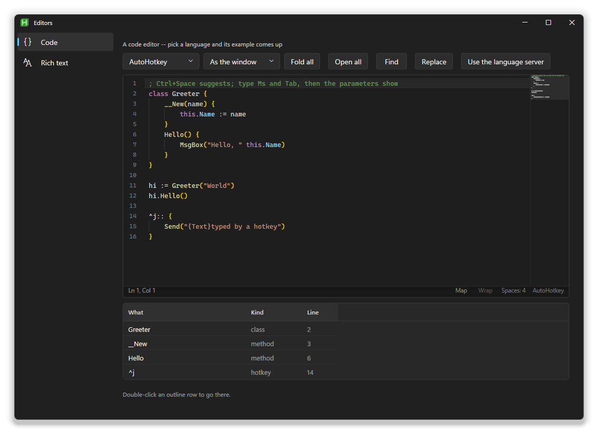

```ahk
code := g.AddCodeEditor("vcode h420 Lang=ahk Theme=auto", FileRead("my.ahk"))
code.UseAhk({Lint: true})              ; AutoHotkey's words, hover cards, and /validate as you type
code.OnSave((text, *) => FileOpen("my.ahk", "w").Write(text))
```

It has colours, line numbers, folding, indent guides, bracket matching, a map
of the whole text down the right, undo, auto-indent, and problems marked in
the gutter. Suggestions come up as you type and match on first letters too
(`fr` finds `FileRead`); picking a function shows its parameters.

**Keys**

| | |
|---|---|
| Ctrl+F, Ctrl+H | Find, replace (Alt+C case, Alt+W whole word, Alt+R regex) |
| Ctrl+G | Go to a line |
| Ctrl+Shift+O | Go to anything the text defines |
| F8 | Next problem |
| Ctrl+/ | Comment |
| Ctrl+D | Duplicate the line |
| Alt+Up, Alt+Down | Move the line |
| Ctrl+Shift+K | Delete the line |
| Ctrl+[ , Ctrl+] | Indent |
| Ctrl+Shift+[ , Ctrl+Shift+] | Fold, unfold |
| Alt+Z | Wrap |
| Ctrl+wheel | Text size |

**Languages:** AutoHotkey, JavaScript, JSON, CSS, HTML/XML, INI, Markdown,
PowerShell, Python, SQL and plain text, plus `AddLanguage(name, def)` for your
own. **Themes:** `auto` (follows the window), `dark`, `light`, `monokai`,
`solarized`, `dracula`, `contrast`. **Presets:**
`Preset=ide|notes|log|config|snippet`. **Flags:** `Wrap`, `NoGutter`,
`NoFold`, `NoSuggest`, `NoStatus`, `ReadOnly`, `Minimap`, `NoMinimap`,
`NoGuides`, `FontSize=`, `Font=`, `Placeholder=`.

**What's behind it is up to you.** `OnComplete(fn)` supplies suggestions,
`OnHover(fn)` the card under the mouse, `OnLint(fn)` the problems after each
pause. `UseAhk()` is the built-in AutoHotkey service. `UseLsp(lsp)` connects a
real language server:

```ahk
lsp := AxLsp(AxLsp.FindAhk2()).Start(A_ScriptDir)   ; the AutoHotkey v2 server, if VS Code has it
code.UseLsp(lsp)
```

Only the lines near what you're looking at are coloured, so a file of
thousands of lines types as fast as a short one. `example\Editors.ahk` has an
example in every language.

## Rich text editor

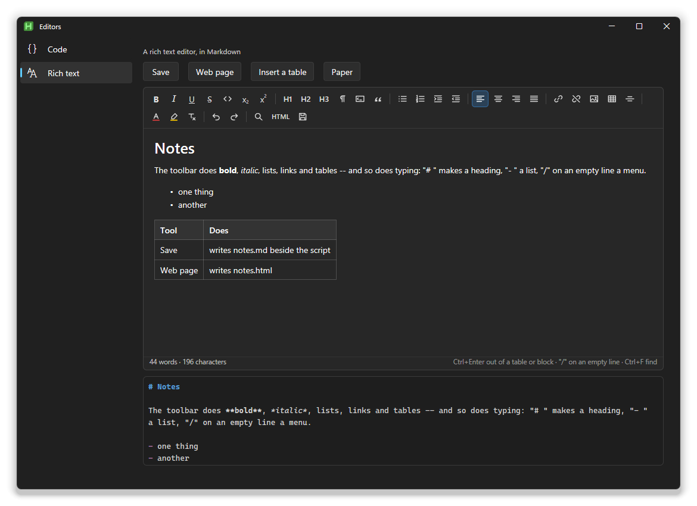

```ahk
doc := g.AddRichText("vnotes h400 Tools=full Format=md", FileRead("notes.md"))
doc.OnEvent("Change", (ctl, md, *) => FileOpen("notes.md", "w").Write(md))
```

A page to write on, with a toolbar: bold, italic, underline, strike, code,
headings, quotes, lists, alignment, links, pictures, tables, colours, find and
replace. It speaks **HTML, Markdown or plain text**: `Format=html|md|text`
says which one `Value` and `Change` give you.

Markdown typing works as you'd hope: `# ` makes a heading, `- ` a list,
`> ` a quote, `**bold**` goes bold, and `/` on an empty line opens a menu of
what the line can become. In a table, Tab moves to the next cell and a small
bar offers rows and columns.

`Tools=` is `minimal`, `standard`, `full`, `none`, or your own list
(`"bold,italic,|,ul,ol,|,table"`). `Paper` makes it a white page whatever the
window's theme. Pasting from Word or a web page drops their fonts and spacing.

Methods: `GetHtml` / `SetHtml`, `GetMarkdown` / `SetMarkdown`, `GetText`,
`Insert`, `InsertTable`, `Exec(tool)`, `Find`, `Clear`, `WordCount`,
`LoadFile`, `SaveHtml`, `SaveMarkdown`, `OnSave`.

## Colour picker

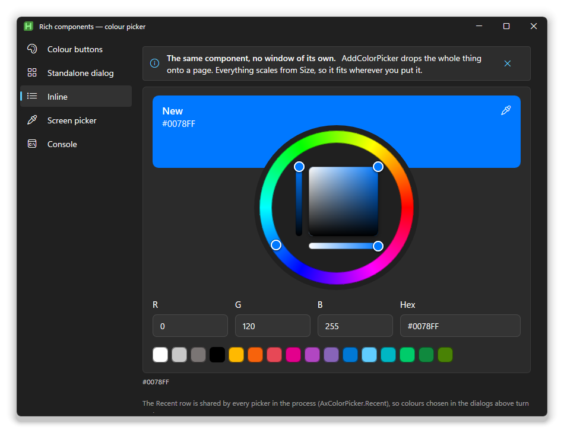

```ahk
hex := AxColorPicker.Show({Current: "#333333"})   ; a window of its own; "" if cancelled
hex := g.PickColor({Current: g.Accent})           ; the same, owned by and themed like g

g.AddColorButton("vAccent", "#0078ff")            ; a swatch that opens it
    .OnPreview((hex, *) => g.SetAccent(hex))      ; live, while the user drags
    .OnChange((c, v, *) => g.SetAccent(v))        ; when they press OK

g.AddColorPicker("vBig Size=300 Swatches", "#0078ff")   ; the whole picker, on the page
```

A hue ring around a saturation and brightness square, with fine tracks, RGB
and hex fields, swatches, recent colours and an eyedropper that picks from
anywhere on the screen (`g.PickScreenColor()` on its own). If the user
cancels, `OnPreview` is called once more with the colour you started with, so
nothing is left half-changed.

Options: `Value`, `Current`, `Size`, `Fields`, `Swatches`, `Recent`,
`Eyedropper`, `CurrentAction`, `Labels`; for the dialog `Title`, `Heading`,
`Icon`, `Buttons`, `Owner`, `OnChange`. The recent colours are
`AxColorPicker.Recent`, an array you can save and restore between runs.

## Dates and times

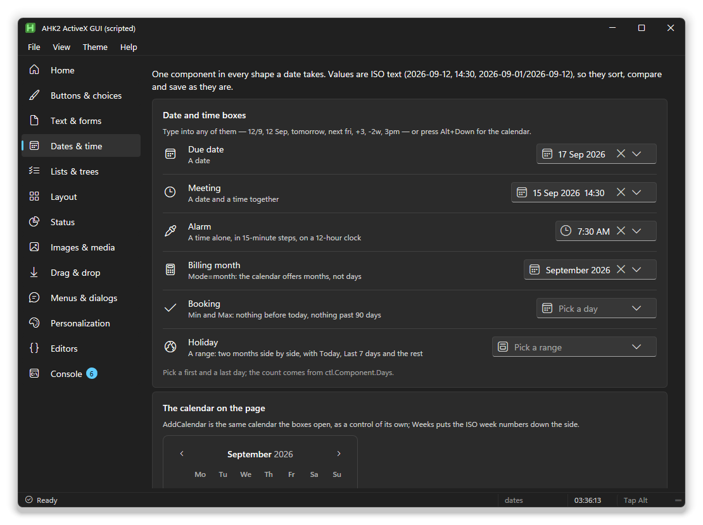

```ahk
g.AddDate("vdue", "today")                     ; type "next fri", "+2w" or "12 Sep", or pick from the calendar
g.AddDate("vmeet Mode=datetime", "2026-09-15 14:30")
g.AddTime("valarm Step=15 Hour12", "07:30")
g.AddDateRange("vtrip")
g.AddCalendar("vcal Weeks")
```

Values are ISO text (`2026-09-15`, `14:30`, `2026-09-01/2026-09-12`), so they
sort, compare and save as they are. `Min=today Max=+90` limits the choice;
`Mode=month` picks months instead of days.

## Charts, gauges and stat cards

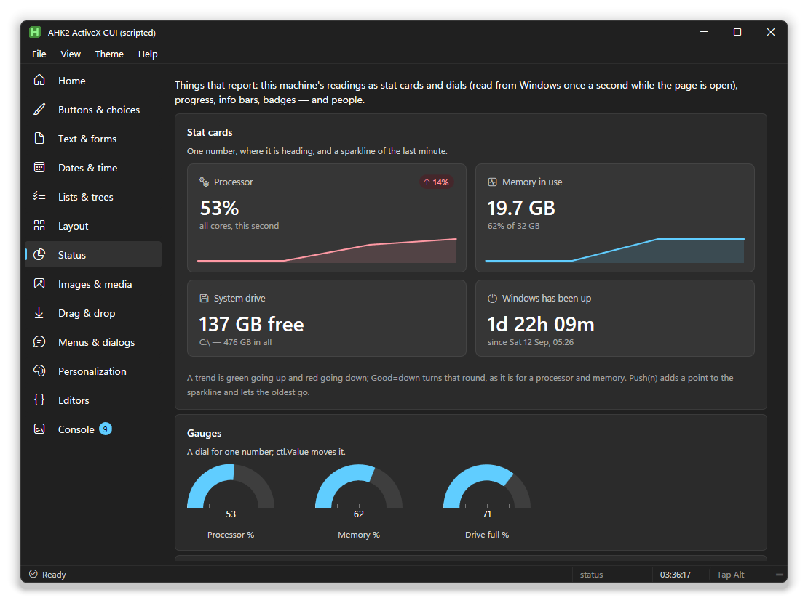

```ahk
g.AddChart("vvisits Kind=line h200 Labels=""Mon,Tue,Wed,Thu,Fri""", "Visits: 12,18,9,22,17`nSignups: 3,5,2,6,4")
g.AddGauge("vcpu w120 Ticks", 55)
g.AddStat('vmem Icon=E9D9 Label="Memory in use" Note="64% of 32 GB" Good=down', "20.5 GB")
```

A chart's data is text, one series per line. `Kind` is `bar`, `line`, `area`
or `donut`. `ctl.Component.Push(n)` adds a point and drops the oldest, which
is a live chart in one line.

## Canvas

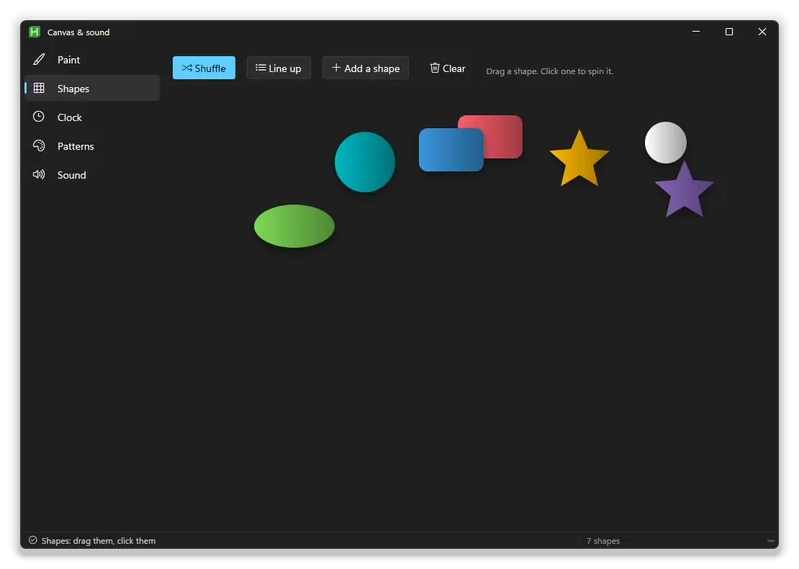

A surface to draw on. `AddCanvas` gives you two layers: a **picture** you
draw once (it stays until you clear it), and a **scene** of shapes you can
change, animate, drag and click at any time. The user can also paint on it.

```ahk
cv := g.AddCanvas("vart Fill Grow h300 Background=#1d1d1d").Component   ; after Show()

; the picture: drawn once, kept
cv.Rect(20, 20, 220, 130, {Fill: ["#ff5f6d", "#ffc371"], Radius: 14, Shadow: "#000 16 0 6"})
  .Text(36, 40, "Hello", {Size: 28, Bold: true, Fill: "#fff"})
  .Line(20, 200, 400, 260, {Stroke: "accent", Width: 4, Dash: [10, 6]})
  .Path("M 450 40 C 520 0, 600 120, 680 60 S 720 200, 640 220 Z", "#7ed957")

; the scene: shapes with a handle
ball := cv.Add("circle", {X: 300, Y: 200, R: 30, Fill: "accent", Drag: true})
ball.Animate({X: 500, Y: 120}, 800, "bounce")
ball.OnClick((s, *) => s.Animate({R: 50}, 300, "back"))
cv.OnDrop((cv, s, x, y) => ToolTip(s.Id " dropped at " x ", " y))
```

<table>
<tr>
<td width="50%">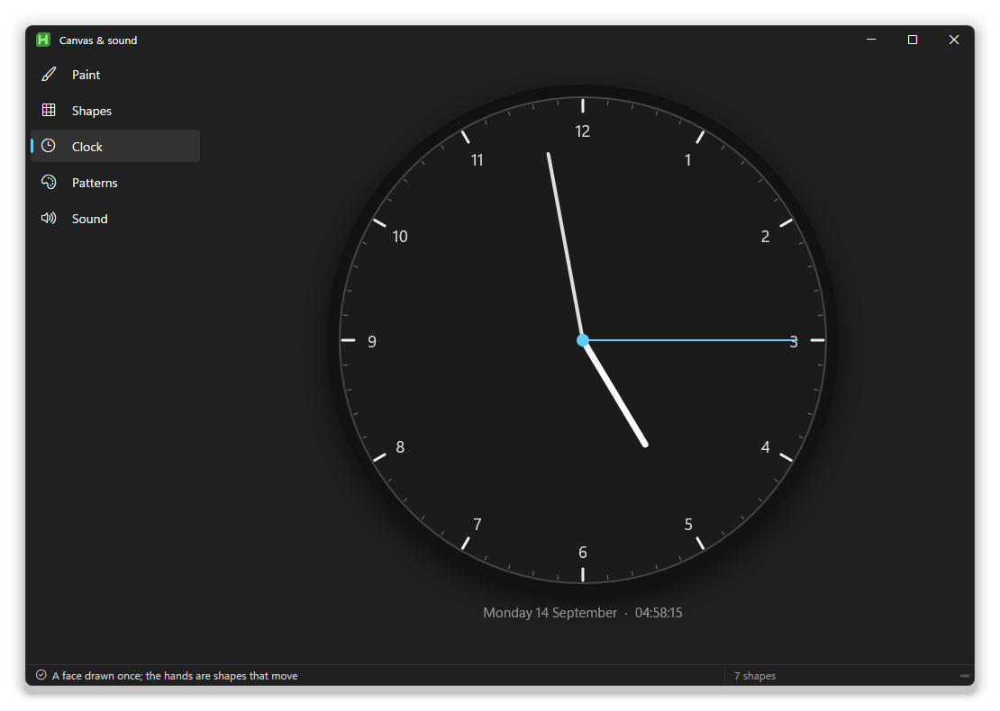<br>A face drawn once, with hands that are shapes</td>
<td width="50%">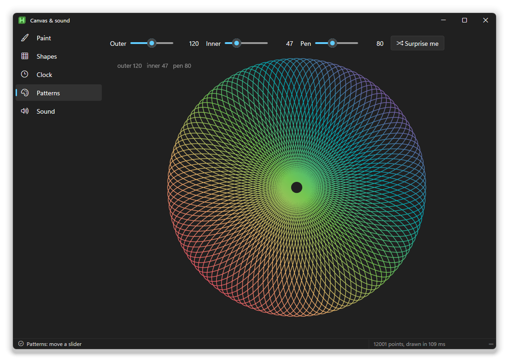<br>12,000 points in one call, redrawn as a slider moves</td>
</tr>
</table>

**Drawing.** `Rect`, `Circle`, `Ellipse`, `Arc`, `Line`, `Poly` (a list of
points), `Path` (SVG path data), `Text` and `Image` (a file or a URL), plus
`Clear` and `Background`. Each takes a style: an object, or just a colour.

| Style | |
|---|---|
| `Fill`, `Stroke`, `Width` | Colours and line width. A list of colours is a gradient: `Fill: ["#f00", "#00f"]`, with `Angle` or `Radial` |
| `Radius`, `Rotate`, `Opacity` | Rounded corners, a turn in degrees, see-through |
| `Shadow` | `"colour blur x y"`, like `"#000 12 0 4"` |
| `Dash`, `Cap`, `Join`, `Blend` | Dashed lines, line ends, corners, and how it mixes with what's under it |
| `Size`, `Font`, `Bold`, `Italic`, `Align` | For text |

Colours can be `accent`, `text`, `back` or `muted`, which follow the window's
look and theme.

**The scene.** `cv.Add(kind, props)` gives back a shape you can `Set`, `Move`,
`Animate(props, ms, ease, done)`, `Remove`, bring to the `Front` or send to
the `Back`. `Drag: true` lets the user move it (or `"x"` / `"y"` for one
direction), and `Hit: false` lets clicks go through it. Animation eases
numbers and `#rrggbb` colours; the eases are `linear`, `in`, `out`, `inout`,
`back`, `bounce` and `elastic`.

**Painting.** `cv.Paint(true, colour, size)` turns on freehand drawing,
`cv.Eraser()` rubs out, `cv.Undo()` takes back a stroke. `Paint` in the
option string starts with it on.

**Everything else.** `OnClick`, `OnDoubleClick`, `OnDrop`, `OnHover`,
`OnPaint`, `OnResize`; `cv.At(x, y)` for the shape at a point; `cv.Every(ms,
fn)` for a timer that redraws; `cv.Save("picture.png")` and `cv.DataUri()`;
`cv.Width` and `cv.Height`; `cv.Ctx(method, args*)` for anything else a 2D
canvas can do.

Your drawing calls are collected and sent to the page in one go at the end of
the current thread, so drawing thousands of things costs one trip, not
thousands. Dragging, painting and animation run in the page at full frame
rate; your script only hears the result.

`example\Canvas.ahk` has a paint program, a scene of shapes, a clock,
spirographs and a music player.

## Audio

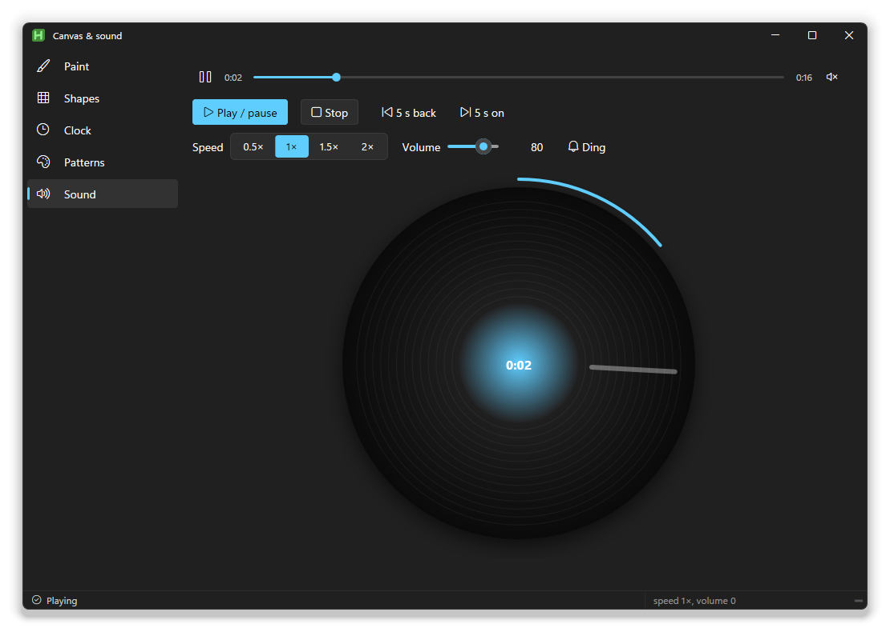

```ahk
a := g.AddAudio("vmusic Fill Loop", "assets\tune.mp3").Component   ; after Show()
a.Play(), a.Volume := 60, a.Rate := 1.5
a.OnTime((a, pos, dur) => ToolTip(Round(pos) " of " Round(dur) " s"))
a.OnEnd((a) => a.Load("next.mp3", true))

g.PlaySound("assets\ding.mp3")          ; a sound effect, no player
```

A player (play and pause, the time, a bar to seek on, mute) around the page's
own audio element. Everything it does you can also do from code: `Play`,
`Pause`, `Toggle`, `Stop`, `Seek(seconds)`, `Load(file, play)`, and
`Position`, `Duration`, `Playing`, `Volume` (0 to 100), `Muted`, `Loop` and
`Rate` (0.25 to 4). Events: `OnPlay`, `OnPause`, `OnEnd`, `OnReady`,
`OnError` and `OnTime(fn, every)`.

Options: `Loop`, `Autoplay`, `NoUi` (no player shown), `Volume=`. It plays
MP3 and AAC (`.m4a`): Internet Explorer's engine doesn't play WAV, OGG or
FLAC, so convert those first.
## Game engine

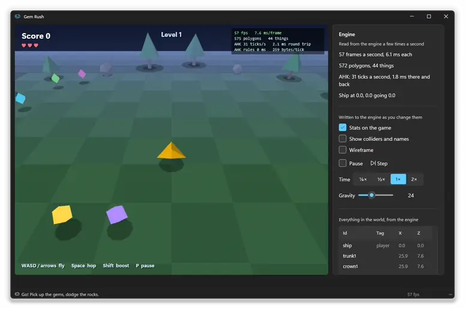

`AddGame` is a small low-poly 3D game engine. The work is split the way it
has to be for a game to feel right:

| The page, 60 times a second | Your script, about 30 times a second |
|---|---|
| The keyboard, movement, gravity, the ground | What the keys mean for the game |
| Behaviours: follow the keys, chase, spin, bob, roll, expire | Spawning, score, lives, levels |
| Collisions between tagged things | What a collision means |
| Particles, the camera, drawing, fog, shadows | The camera, the world, the HUD |

Every tick, your script gets the keys held and just pressed, what hit what,
and where the things it's watching are. It answers with commands, all sent in
one go. A slow rule costs a little delay in the rules, never a dropped frame.

```ahk
eng := g.AddGame("vgame Grow h420 Tick=30").Component          ; after Show()

eng.World({Gravity: 24, Sky: ["#101830", "#6f86bd"], Fog: [16, 52], Bounds: 22})
eng.Spawn("ship", {Mesh: "ship", Color: "#ffb900", Solid: true, Gravity: 1,
                   Control: {Speed: 12, Jump: 10}, Hits: ["gem"], Watch: true})
eng.Spawn("gem1", {Mesh: "octa", Color: "#44e0ff", X: 6, Y: 1.3, Spin: [0, 140, 0], Tag: "gem"})
eng.Camera({Follow: "ship", Dist: 14, Height: 10})
eng.Hud("score", {Text: "Score 0", X: 18, Y: 14, Size: 22})

eng.OnTick((eng, t) => t.Pressed.Has("p") ? eng.Pause(!eng.Paused) : "")
eng.OnHit(Picked)

score := 0
Picked(eng, a, b, tag) {                   ; the ship touched something it Hits
    global score
    score += 10
    ship := eng.Entity("ship")
    eng.Burst({X: ship.X, Y: 1, Z: ship.Z, Color: "#44e0ff"})
    eng.Kill(b)
    eng.Hud("score", {Text: "Score " score})
}
```

**Things.** `eng.Spawn(id, props)` puts one in the world. `Set`, `Kill`,
`KillTag` and `Entity(id)` change and find them. A thing is a mesh (`cube`,
`tetra`, `octa`, `pyramid`, `ico`, `prism`, `ship`, or your own with
`eng.Mesh(name, vertices, faces)`) with a position, rotation, scale and
colour, plus any of these:

| | |
|---|---|
| `Gravity`, `Solid`, `Bounce`, `Drag` | Falls, stands on the ground, bounces, slows down |
| `Control: {Speed, Accel, Jump}` | Flown by WASD or the arrows, Space to jump |
| `Chase: {Target, Speed, Turn}` | Steers after another thing |
| `Spin: [x, y, z]`, `Bob: {Amp, Speed}`, `Roll` | Turns, floats up and down, rolls as it moves |
| `Tag`, `Hits: [tags]` | What it is, and which tags' collisions to report |
| `Bounds: "clamp" / "bounce" / "kill"`, `Life` | At the edge of the world; seconds until it goes |
| `Watch` | Its position and speed come back with every tick |
| `Flash`, `Glow`, `Hidden`, `Frozen`, `Shadow` | Blinks, unlit, invisible, stopped, no shadow |

**The world.** `World({Gravity, Sky, Fog, Ambient, Light, Ground, Bounds,
TimeScale})`, `Camera({Follow, Dist, Height, Fov})`, `Hud(id, {Text, X, Y,
Size, Color, Align})` for text over the game, `Burst({X, Y, Z, N, Color})`
for particles, and `Pause`, `Step`, `TimeScale`, `Shake`, `Clear`.

**Events.** `OnTick(fn(eng, t))` with `t.Dt`, `t.Time`, `t.Keys`, `t.Pressed`,
`t.Hits`, `t.Stats` and `t.List`; `OnHit(fn(eng, a, b, tag))`; `OnKey`.

**Seeing inside.** `eng.Debug({Stats: true, Colliders: true, Wire: true})`
draws the numbers (frames a second, polygons, ticks a second, the round trip
to your script), every collider with its name, and the mesh edges.
`eng.Stats` has the same numbers for your own panel, and `eng.List(true)`
puts every thing in `t.List`. An error in your rules shows on the game with
its file and line, and the game keeps running.

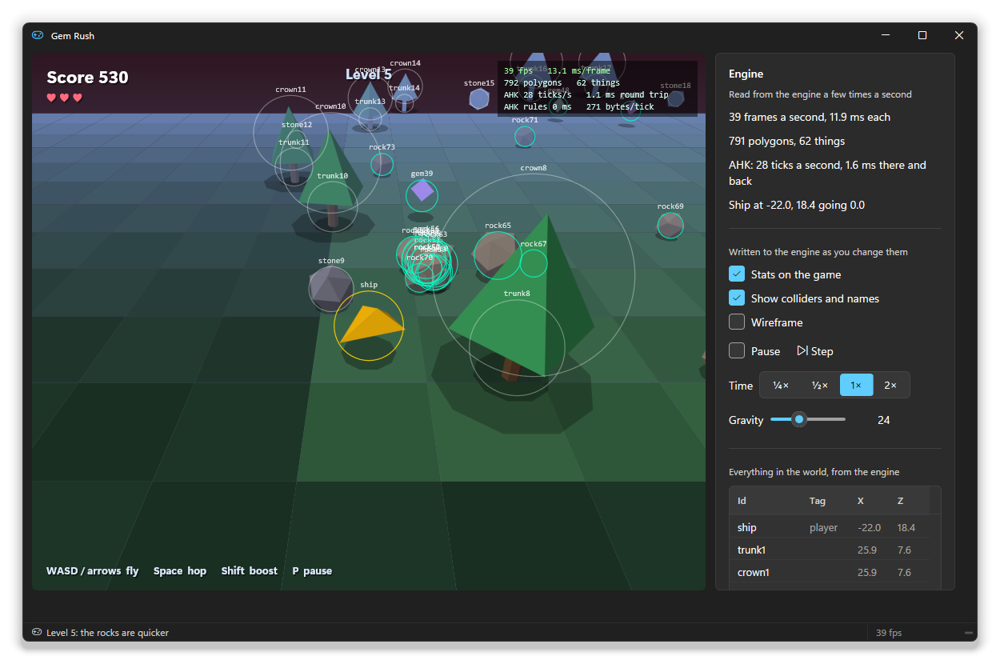

`example\Game.ahk` is **Gem Rush**: fly, collect gems, dodge the rocks that
roll after you, and level up. The panel on the right reads the engine a few
times a second and writes its settings back.

**Why it's smooth.** Each frame is drawn between the last two physics steps,
so motion stays even on a 144 Hz screen or when a frame comes late. The page
reaches your script through a function the script hands it, which costs under
a microsecond, and your rules run after the frame is on screen, so they
never lengthen it. What does cost a frame is changing the page from the
script, because the page lays itself out again. Setting a few texts is cheap.
Redrawing a 45-row list takes about 13 ms. Update panels a few times a second,
not thirty.

### The 2D world


`Mode=2D` on the control, or `eng.World({Mode: "2d"})`, gives you a
top-down world of tiles, like an old adventure game. Everything above still
applies: things, behaviours, collisions, ticks, the HUD, particles and the debug
views. Positions are in tiles, `X` to the right and `Y` down.

```ahk
eng.World({Mode: "2d", Tile: 36})
eng.Map(["TTTTTTTT",
         "T..:...T",
         "T..:.~~T",
         "TTTTTTTT"], Map(
    ".", {Color: "#4f8f3f", Deco: "grass"},
    ":", {Color: "#c8a86b", Deco: "path"},
    "~", {Color: "#2f6fb0", Deco: "water", Solid: true},
    "T", {Color: "#4f8f3f", Deco: "tree", Solid: true}))
eng.Spawn("hero", {Sprite: "hero", X: 2.5, Y: 1.5, Solid: true, Control: {Speed: 5},
                   Hits: ["coin"], Label: "Aria", Watch: true})
eng.Spawn("slime1", {Sprite: "slime", X: 5.5, Y: 1.5, Solid: true, Tag: "slime",
                     Wander: {Speed: 1}, Chase: {Target: "hero", Range: 3.5}})
eng.Camera({Follow: "hero"})
```

- **The map.** Each character is a tile, and the legend says what it is: a
  `Color`, whether it's `Solid`, and a `Deco` pattern drawn on it (`grass`,
  `flowers`, `brick`, `water`, `planks`, `path`, `tree`, `rock`, `door`,
  `roof`). `eng.Tile(x, y, ch)` changes one tile, for example to open a gate,
  and `eng.TileAt(x, y)` reads one. The map is drawn once into a picture and
  copied to the screen in a single call each frame.
- **Sprites.** A few are built in: `hero`, `elder`, `villager`, `slime`,
  `coin`, `potion`, `key`, `chest`, `heart` and `gem`. Draw your own as pixel
  art with `eng.Sprite(name, rows, palette)`, where `.` is see-through. A thing
  without a sprite is a `Shape` (`circle`, `box`, `diamond`) in its `Color`.
- **Behaviours.**
  - `Control` walks in eight directions.
  - `Chase: {Target, Speed, Range}` gives chase only within range.
  - `Wander: {Speed, Every}` ambles about.
  - `Solid` things stop at solid tiles and slide along walls.
  - `Label` puts a name tag over a thing, and `Layer: 0` keeps it flat under
    the others.
- **Asking the page.** `eng.Near("hero", "npc", 1.8)` gives the nearest thing
  with that tag. `eng.Within(x, y, dist, tag)` gives all of them.
  `eng.Float(x, y, "+1", {Color})` shows a number that rises and fades.
  `Hud(id, {..., Box: true})` puts text in a panel, for speech and signs.

Every letter and digit key comes through by name (`t.Pressed.Has("e")`).

The studio's **Quest** template is a whole small adventure built on this: a
village, a meadow of slimes, a locked grove and a chest. See [the studio's
guide](studio.md#a-game-in-the-studio).
## Splitter

```ahk
g.AddSplitter("vsp Target=sidePane Min=140 Max=460")
```

A divider you can drag between two parts of a page. It resizes the element
named by `Target` (or the control before it), and whatever is on the other
side takes up the rest. `Horizontal` drags up and down.

## Writing your own

A component is a folder under `lib\components` with an `.ahk` file, a
stylesheet, and a small manifest that tells the studio about it. Nothing in
the core needs to know it exists. [lib/components/README.md](../lib/components/README.md)
walks through the files, and [extending](extending.md) through adding one to
the studio's toolbox.
