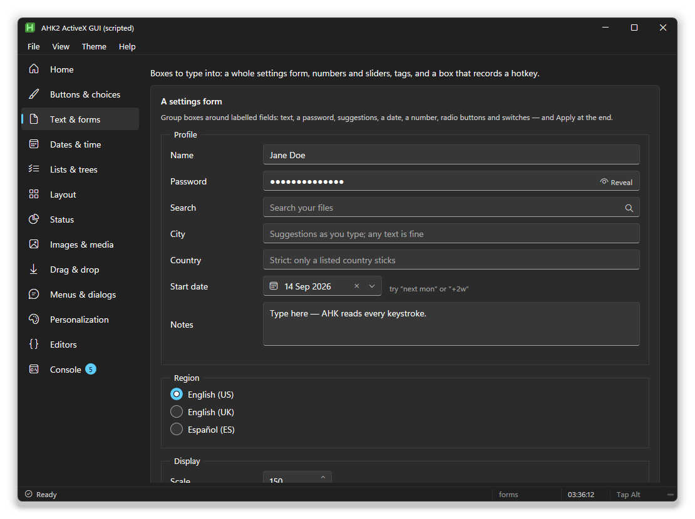
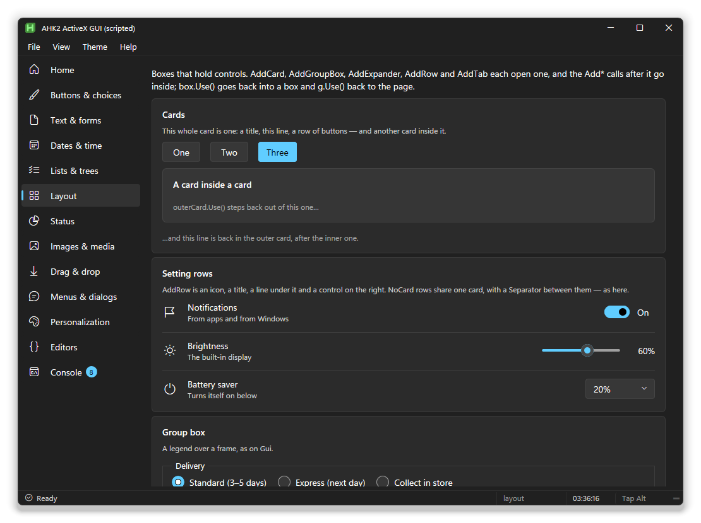
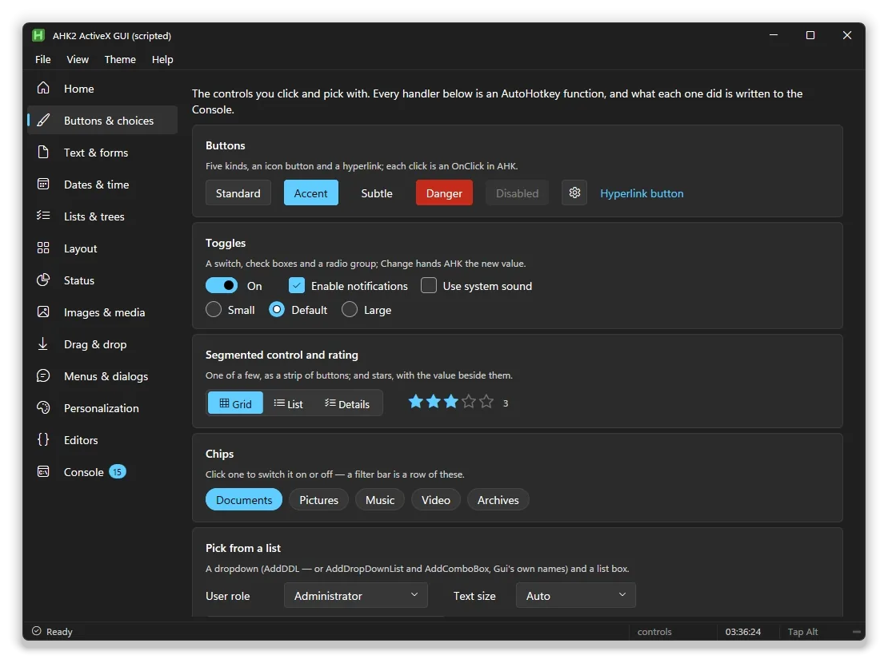
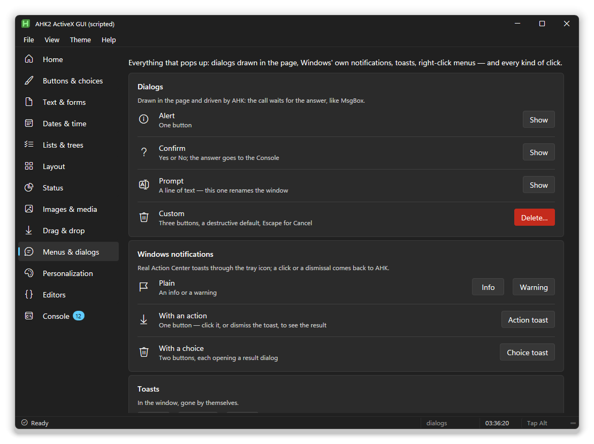
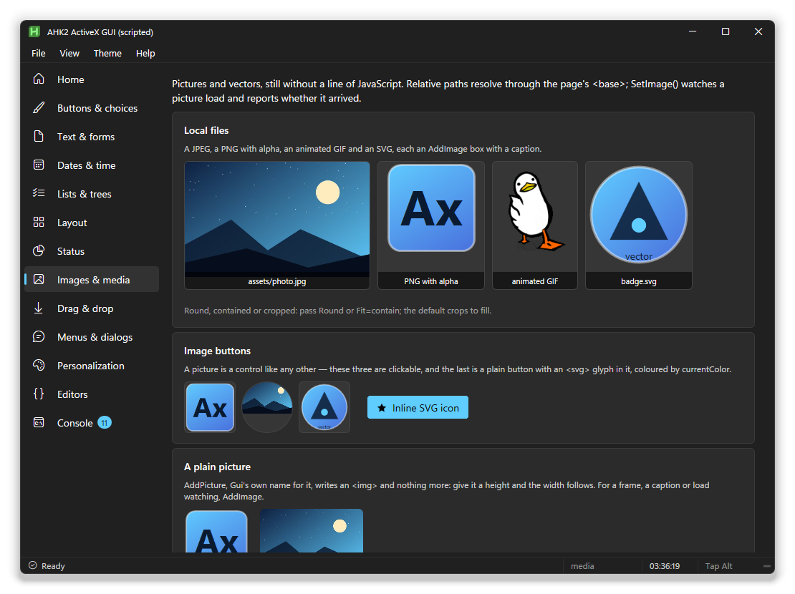

# The guide

This is how you build a window with the library, from the first line to a
single `.exe`. If you have written a `Gui` before, most of it will feel
familiar: the difference is what the window looks like.

- [Your first window](#your-first-window)
- [Adding controls](#adding-controls)
- [Laying things out](#laying-things-out)
- [Reacting to the user](#reacting-to-the-user)
- [Dark, light and colour](#dark-light-and-colour)
- [Menus and the status bar](#menus-and-the-status-bar)
- [Your own title bar](#your-own-title-bar)
- [Dialogs, toasts and notifications](#dialogs-toasts-and-notifications)
- [Right-click menus](#right-click-menus)
- [Pictures and SVG](#pictures-and-svg)
- [Drag and drop](#drag-and-drop)
- [Native controls in the page](#native-controls-in-the-page)
- [The window itself](#the-window-itself)
- [Writing the page in HTML instead](#writing-the-page-in-html-instead)
- [One .exe](#one-exe)

The big controls (the data grid, list and tree views, the editors, the colour
picker) have a page of their own: [components](components.md). Every option
and method is listed in the [reference](reference.md).

## Your first window

```ahk
#Requires AutoHotkey v2.0
#Include lib\AxGui.ahk

g := AxGui({Title: "Hello", Width: 420, Height: 240})
g.AddText("", "What's your name?")
name := g.AddEdit("vname w240", "World")
g.AddButton("Accent", "Greet").OnEvent("Click", (*) => g.Toast("Hello, " name.Value))
g.Show()
```

`AxGui` takes an options object instead of a `Gui` options string. The ones
you'll use most are `Title`, `Width`, `Height`, `Theme` (`"dark"`, `"light"`
or `"system"`), `Stylesheet` (the look, see [themes](themes.md)) and `Accent`.

`Show()` builds the page and puts the window up. Nothing is written to disk:
the page lives in memory.

## Adding controls

`g.Add<Thing>(options, value)` works like `Gui.Add`, and gives you back a
control with `.Value`, `.Text`, `.Enabled`, `.Visible` and `OnEvent`.


| You want | Call |
|---|---|
| A label | `AddText("", "Hello")` |
| A text box | `AddEdit("vName w240", "text")`, `AddPassword`, `AddSearch`, `AddAutoComplete` |
| A button | `AddButton("Accent", "Save")`, also `Subtle`, `Danger`, `Icon` |
| A tick box, a switch, radios | `AddCheckBox`, `AddSwitch`, `AddRadio("Choose1", "a:One\|b:Two")` |
| A choice | `AddDDL` (`AddDropDownList`, `AddComboBox`), `AddListBox`, `AddSegmented` |
| A number | `AddNumber`, `AddSlider`, `AddRating` |
| A date or time | `AddDate`, `AddCalendar` |
| Progress | `AddProgress`, `AddInfoBar`, `AddBadge` |
| A hotkey box | `AddHotkey("vHk", "^!h")` |
| Tags, chips | `AddTags`, `AddChip` |
| A picture | `AddImage`, `AddImageButton`, `AddSvg` |
| A chart or a dial | `AddChart`, `AddGauge`, `AddStat` |
| A list, a table, a tree | `AddListView`, `AddTreeView`, `AddDataView` ([components](components.md)) |
| Something to draw on | `AddCanvas` ([components](components.md#canvas)) |
| Music and sounds | `AddAudio`, `g.PlaySound(file)` ([components](components.md#audio)) |
| A game | `AddGame` ([components](components.md#game-engine)) |

The option string is the one you know from `Gui.Add`:

- `vName` gives the control a name, which `g.Value("Name")` and `ctl.Name` use.
- `w240`, `h80` set the size; `x+8` puts the control on the same line as the
  last one, 8 px to the right; `y+12` starts a new line 12 px down; `x20 y40`
  places it exactly.
- `Checked`, `Disabled`, `Hidden`, `ReadOnly`, `Choose2` do what they say.
- `Fill` stretches the control across its line. `Grow` gives it the height
  that's left (see [below](#filling-the-window)).
- `Key=Value` pairs carry the rest: `Icon=E713`, `Tip="Saves the file"`,
  `Min=0 Max=100 Step=5`, `Suffix="%"`, `Rows=3`, `Placeholder="Search"`.

Icons are four-character codes from **Segoe Fluent Icons**, the icon font in
Windows 11 (`E713` is the gear). Microsoft's [icon list](https://learn.microsoft.com/windows/apps/design/style/segoe-fluent-icons-font)
has them all.



## Laying things out

**Pages.** `AddPage(id, label, icon)` starts a page and adds it to the rail on
the left. Everything you add goes on the most recent page. `g.ShowPage(id)`
switches, and `g.OnPage(fn)` tells you when the user did.

**Boxes.** `AddRow`, `AddCard`, `AddGroupBox`, `AddExpander`, `AddGrid` and
`AddTab` open a box, and the controls you add next go inside it. `g.Use()`
closes the box and takes you back to the page.

```ahk
g.AddRow("Icon=E7E7", "Notifications", "Banners, sounds and badges")  ; a Windows Settings row
g.AddSwitch("vnotify Checked")                                         ; sits on the right of it
g.Use()

card := g.AddCard("", "Profile")
g.AddText("w120", "Name")
g.AddEdit("vname x+8 Fill")
g.Use()

tabs := g.AddTab("vtabs", ["General:E713", "History:E81C"])   ; label:icon
tabs.UseTab(1)
g.AddCheckBox("", "Start with Windows")
tabs.UseTab(2)
g.AddCheckBox("", "Keep a history")
tabs.UseTab()                                                  ; out of the tabs
```

A box you keep hold of can be re-entered later with `card.Use()`, and adding
to a box after `Show()` puts the control in straight away.



**Filling the window.** A control with `Grow` takes the height its page or box
has left, and keeps taking it as the window is resized. That's how you get a
list or an editor that fills the window with buttons pinned underneath it.
`hN` alongside `Grow` is the least it gets (below that the page scrolls).
Several `Grow` controls on one line grow together, and lines that grow share
the space.

**Headings.** A page that sits under a rail doesn't repeat its name as a
heading, because the highlighted rail item already says it. A dialog or a
single-page window keeps its heading. `Headings: true` or `false` in the
options overrides that.

**The rail.** `g.NavMode("toggle")` folds the page rail down to its icons and
back, which is what a burger button in the title bar usually does.

## Reacting to the user

```ahk
btn.OnEvent("Click", (ctl, *) => MsgBox("Clicked"))
sw.OnChange((ctl, value, *) => g.SetTheme(value ? "dark" : "light"))
edit.OnEvent("KeyUp", (ctl, ev, el) => ToolTip(el.value))
```

Events: `Click`, `DoubleClick`, `Change`, `Focus`, `Blur`, `KeyDown`, `KeyUp`,
`ContextMenu`, and `Hotkey` for a hotkey box. `ctl.OnClick(fn)` and
`ctl.OnChange(fn)` are shorthands. There's also `OnMiddleClick`,
`OnTripleClick` and `OnMultiClick(n, fn)`.

Read and set values with `ctl.Value` or by name with `g.Value("name")` and
`g.Value("name", newValue)`. Setting a value from your script doesn't fire
`Change`, the same as a `Gui`.

**Hotkeys.** A hotkey box records a key combination. `g.Hotkey("hk", fn)`
binds whatever it holds, and follows it when the user records a new one.

## Dark, light and colour

```ahk
g.SetTheme("light")              ; "dark", "light" or "system"
g.SetAccent("#c239b3")           ; or "system" for the Windows accent colour
g.SetTint("accent", 0.1)         ; wash the background with a colour
g.SetStylesheet("winxp")         ; a whole different look
```

All four change the open window on the spot.



`Theme: "system"` follows the Windows setting. The script's popup menus
follow the theme too: the tray menu, the window's system menu and any
`Menu.Show()` turn dark or light with it (Windows 10 1903 and later). The
stylesheets, and how to write your own, are on the [themes](themes.md) page.

## Menus and the status bar

```ahk
g.AddMenuBar([
    {Title: "&File", Items: [["&New", NewFile], "-", {Label: "E&xit", Shortcut: "Alt+F4", Click: (*) => ExitApp()}]},
    {Title: "&View", Items: () => [
        {Label: "&Dark",  Radio: true, Checked: g.Theme = "dark",  Click: (*) => g.SetTheme("dark")},
        {Label: "&Light", Radio: true, Checked: g.Theme = "light", Click: (*) => g.SetTheme("light")}]}
], {Reveal: "alt"})

g.AddStatusBar([{Id: "msg", Text: "Ready", Icon: "E930", Grow: true},
                {Id: "pos", Text: "Ln 1, Col 1", Width: 110}])
g.Status("msg", "Saved")
g.StatusProgress("msg", 45)       ; a small progress bar in the part; "" puts the text back
```

A menu item is `["Label", fn]`, `"-"` for a line, or an object with `Label`,
`Click`, `Shortcut`, `Disabled`, `Checked`, `Radio`, `Icon` and `Items` (a
submenu). Give `Items` a function instead of an array and the menu is rebuilt
each time it opens, so ticks and radio marks are always current.

`&` marks the access key. Alt or F10 opens the bar from the keyboard, and the
arrow keys, Enter and Escape work the way they do in any Windows menu.
`Reveal: "alt"` hides the bar until Alt is pressed, like Explorer.

## Your own title bar

The title bar has room for your own items, on the left after the icon and on
the right before the caption buttons. An item can be a burger, an icon, a
word, a search box, a picture, an SVG, a separator or a gap. It can run a
function, open a menu, or open a pop-over.


```ahk
g.AddTitleBar([
    {Id: "burger", Kind: "burger", Class: "morph", Toggle: true, Click: (*) => g.NavMode("toggle")},
    {Id: "name", Text: "Workspace"},
    {Id: "file", Text: "File", Menu: () => [["&New tab", NewTab], "-", ["E&xit", (*) => ExitApp()]]},
    {Kind: "sep"},
    {Id: "find", Kind: "html", Class: "axtb-search", Html: '<input type="text" id="q" placeholder="Search">'},
    {Id: "me", Side: "right", Glyph: "E77B", Popover: {On: "hover", Build: AccountCard}}
], {ShowTitle: false})
```

`g.TitleItem("name", {Text: "Saving..."})` changes an item later, and a
burger with `Class: "morph"` animates into a cross when it's toggled on. The
empty parts of the bar still drag the window. `example\Titlebar.ahk` has the
lot, with its own look switcher.

**Pop-overs.** A pop-over is a panel of your own markup that opens next to an
element when it's clicked or hovered, and closes on Escape or a click
elsewhere:

```ahk
g.Popover("acct", {Build: AccountCard, On: "hover", Align: "right", Width: 280})
```

`Build` is called every time it opens, so it can show what's current. The
controls inside it are ordinary page controls: `On`, `Value` and `OnValue`
reach them by id.

## Dialogs, toasts and notifications



```ahk
g.Alert("The file was saved.")
if g.Confirm("Delete 3 files?", "Delete")
    DeleteThem()
name := g.Prompt("New name:", "Rename", "Holiday photos")
r := g.Dialog("Save changes?", "Unsaved work", ["Save", "Don't save", "Cancel"])   ; r.Button, r.Value

g.Toast("Copied", 2000, "success")         ; a small message inside the window

g.Notify("Build finished", "3 warnings", "info", {Buttons: ["Open folder"], OnClick: (arg, label) => Run("out")})
```

The dialogs are drawn inside the window and wait for an answer, like
`MsgBox`. `Notify` raises a real Windows notification. Add `AppName: "My app"`
to the window's options and it carries your app's name and icon instead of
Explorer's.

## Right-click menus

```ahk
g.ContextMenu("files", [["&Open", OpenIt], ["&Rename", RenameIt], "-", {Label: "&Delete", Click: DeleteIt}])
g.ContextMenu("*", myMenu)                 ; everywhere else in the window
g.ShowMenu(items)                          ; open one now, at the mouse (for a toolbar button)
```

The items are the same shape as the menu bar's, so one menu can be used in
both places.

## Pictures and SVG



```ahk
g.AddImage("vphoto w240 h160 Fit=cover", "assets\photo.jpg")
g.SetImage("photo", "https://example.com/new.png", {OnError: (*) => g.Toast("Couldn't load it")})
g.AddSvg("w48 h48", '<svg viewBox="0 0 24 24"><circle id="dot" cx="12" cy="12" r="8" fill="currentColor"/></svg>')
g.SvgSet("dot", "r", 10)
```

Relative paths are relative to the script. A picture that fails to load shows
a message instead of a broken icon, and `SetImage` tells you when it arrives
or fails. The shapes inside an SVG are part of the page, so you can give them
ids and click, restyle or animate them from AutoHotkey.

## Drag and drop

**Files from Explorer.**

```ahk
g.AddDropZone('vdz Accept=images Browse Desc="PNG, JPG, GIF"', "Drop pictures here")
    .OnDrop((files, *) => g.Toast(files.Length " picture(s)"))
g.DropZone("*", (files, *) => OpenAll(files))       ; the whole window
```

`files` is an array of full paths. `Accept` can be `images`, `media`, `docs`,
`text`, `folders`, a list like `"*.png;*.jpg"` or a function. While a drag is
over the zone it highlights, or shows a no-entry cursor if it won't take what
you're holding. `Browse` makes a click on the zone open a file picker.

`g.SelectFolder("Pick a folder")` opens the modern folder picker (the one with
the address bar and search), not the old tree `DirSelect` shows.

**Reordering.** Tiles in an `AddGrid`, and any list marked sortable, can be
dragged into a new order. `OnValue` hands you the new order. With
`data-hold="500"` a drag only starts after a press and hold, like a phone's
home screen.

## Native controls in the page

```ahk
web := g.AddActiveX("vweb Stretch", "Shell.Explorer.2")
web.Object.Navigate("https://www.autohotkey.com")
```

A real control (a web browser, a video player, any ActiveX control) is docked
over a spot in the page. It follows the page when the window is resized,
switches with its page, and hides behind dialogs. `example\Embed.ahk` has a
browser with a toolbar, a video player and a document viewer.

Check `AxWindow.HasControl(progId)` first: Windows quietly shows a web browser
instead of a control that isn't installed. (Windows Media Player's control is
missing on Windows 11 unless you turn on the "Windows Media Player Legacy"
feature.)

## The window itself

- **Size and resizing.** `Width`, `Height`, `MinWidth`, `MinHeight`, `X`, `Y`,
  and `Resizable`, `MaximizeBox`, `MinimizeBox`. These set the real window
  styles, so Snap and the taskbar respect them.
- **Icon.** `Icon: "auto"` (the default) shows the script's own icon in the
  title bar. You can also give an icon code (`"E790"`), a file
  (`"shell32.dll,13"`, `"app.ico"`, `"logo.png"`), or `""` for none.
  `g.SetIcon()` changes the tray, taskbar and title bar together.
- **Focus.** `NoActivate: true` brings the window up without taking focus,
  for tool windows and anything that runs in the background.
- **Escape and closing.** `EscapeCloses: true`; `ExitOnClose: false` keeps the
  script running when the window closes; `g.OnClose(fn)`. To ask first, see
  below.
- **Zoom.** Ctrl+wheel and Ctrl+plus are blocked, so the page can't be zoomed
  by accident. `AllowZoom: true` turns them back on.
- **Border.** `BorderColor` and `SnapBorder` colour the window's edge.
- **Faster start.** `GpuRendering: false` draws with the CPU. The window comes
  up about 150 ms sooner and nothing looks different. Under AutoHotkey the
  setting is shared by every script `AutoHotkey64.exe` runs.
- **Always on top.** `g.AlwaysOnTop(true)`.

### Asking before it closes

A window can have a say before it closes, however that happens: its close
button, a double-click on its icon, Alt+F4, the taskbar, the system menu,
Escape, or the tray's Exit and Reload.

```ahk
g.Dirty := true                       ; something changed: the title shows a dot
g.AskBeforeClose(SaveNotes)           ; unsaved? Save / Don't save / Cancel
SaveNotes(win) {
    FileAppend(notes.Value, "notes.md")
    win.Dirty := false
    return true                       ; false: not saved after all, so stay open
}
```

- **`g.Dirty`** marks unsaved changes. Set it when something changes and clear
  it once saved. While it's set, the title shows a dot.
- **`g.AskBeforeClose(save, opts)`** asks only when there are unsaved changes.
  The question is Save / Don't save / Cancel, or Close anyway / Cancel without a
  save function. The options are `Text`, `Title`, and `Always: true` to ask
  every time.
- **`g.OnBeforeClose(fn)`** is the hook underneath: `fn(win, why)` runs first,
  and returning true keeps the window open. `why` says how the close came:
  `button`, `icon`, `system` (Alt+F4, the taskbar, the system menu), `escape`,
  `exit` (the tray) or `code`.
- **`g.Close(true)`** closes without asking anyone.

`example\Editors.ahk` asks before closing with unsaved notes, and has a
switch to turn it off.

**The inspector.** While you build, press **F12** over your window for a DevTools-style inspector: the page
tree, styles, and which AutoHotkey function each click reaches. See
[inspector](inspector.md).

## Writing the page in HTML instead

If you'd rather lay the page out by hand, write it as an HTML file with the
library's `<ax-*>` tags and open it with `AxWindow`:

```ahk
#Include lib\AxWindow.ahk
app := AxWindow(A_ScriptDir "\app.html", {Width: 720, Height: 480, Theme: "system"})
app.OnReady((w) => (
    w.On("click", "btnHello", (*) => w.Toast("Hello from AHK")),
    w.OnValue("rgTheme", (v, *) => w.SetTheme(v))))
app.Show()
```

```html
<!DOCTYPE html>
<html><head><meta http-equiv="X-UA-Compatible" content="IE=edge"><meta charset="utf-8">
<title>My app</title>
<link rel="stylesheet" href="lib/themes/win11.css">
</head><body>
<ax-nav pages="home:Home:E80F,settings:Settings:E713"></ax-nav>
<ax-content>
  <ax-page id="home" title="Home" active>
    <ax-row icon="E8BD" title="Say hello" desc="Runs AHK from a page button">
      <ax-button id="btnHello" kind="accent">Hello</ax-button>
    </ax-row>
  </ax-page>
  <ax-page id="settings" title="Settings">
    <ax-row title="Theme"><ax-radio id="rgTheme" options="light:Light,dark:Dark,system:System" value="system" inline></ax-radio></ax-row>
  </ax-page>
</ax-content>
</body></html>
```

`On(event, id, fn)` listens to an element, `OnValue(id, fn)` to a control's
value, and `Text`, `Html`, `Value`, `AddClass` and friends change the page.
The tags and their attributes are listed in the [reference](reference.md#tags).
Plain HTML works too, using the classes the stylesheet defines.

The page is drawn by Internet Explorer 11's engine. Flexbox, transitions,
transforms and SVG work; CSS grid, `gap` and CSS variables don't.

## One .exe

Ahk2Exe can put the themes, icons and pictures inside the executable, so it
runs without a `lib` folder next to it. Add two lines at the top of the
script:

```ahk
#Requires AutoHotkey v2.0
;@Ahk2Exe-Let U_AxLib = %A_ScriptDir%\lib     ; where lib is, relative to this script
#Include lib\AxGui.ahk
#Include lib\AxAssets.ahk                      ; does nothing when the script isn't compiled
```

Then compile as usual:

```bash
"C:\Program Files\AutoHotkey\Compiler\Ahk2Exe.exe" /in MyApp.ahk /out MyApp.exe /base "C:\Program Files\AutoHotkey\v2\AutoHotkey64.exe"
```

Every example already has the two lines. Your own files go in with
`;@Ahk2Exe-AddResource path, NAME` and come back out with
`AxSys.ResourceText(name)` or `AxSys.ResourceFile(name)`.
