# AxStudio

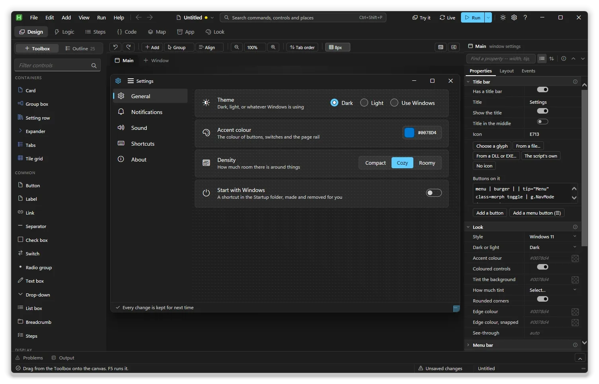

AxStudio is a designer for AxGui windows. You drag controls onto a window,
say what they do, and export a `.ahk` script that runs on its own. The window
on the canvas is the real thing: the library builds it, in your theme, in the
same browser control your script will use.

## The five-minute version

1. Start it. Run `AxStudio.ahk` itself; the other files in `studio\` are
   parts of it.

   ```bash
   "C:\Program Files\AutoHotkey\v2\AutoHotkey64.exe" studio\AxStudio.ahk
   ```

2. Pick a template on the start screen, or **Blank** for an empty page.
3. Drag controls from the **Toolbox** on the left onto the canvas. Click one
   and change it in the **inspector** on the right.
4. Press **F6** to try the window on the canvas, and **F6** again to go back
   to editing. Press **F5** to run it as a real script.
5. **Ctrl+S** saves the project. **Ctrl+E** exports the `.ahk`.

## Templates

The start screen offers your unsaved work from last time, your recent
projects, and these eighteen templates. Each one is a small working program
with named controls and code that runs, so it doubles as an example. The cards
are tagged with what each uses (**Bindings**, **Rules**, **Timers**, **No
code** and so on).

<table>
<tr>
<td align="center">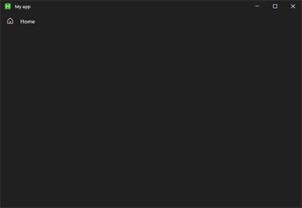<br><b>Blank</b><br>One empty page</td>
<td align="center">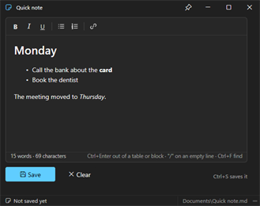<br><b>Quick note</b><br>Rich text, a footer, a pin to keep it on top</td>
<td align="center">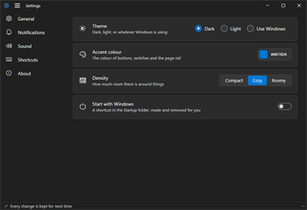<br><b>Settings app</b><br>Setting rows the program remembers</td>
</tr>
<tr>
<td align="center">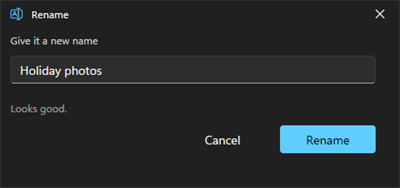<br><b>Dialog</b><br>A rename dialog, all bindings</td>
<td align="center">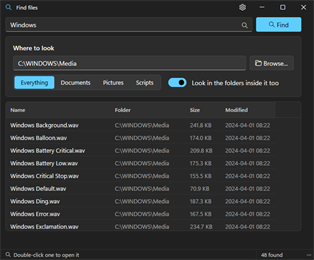<br><b>Tool window</b><br>Find files, with folding options</td>
<td align="center">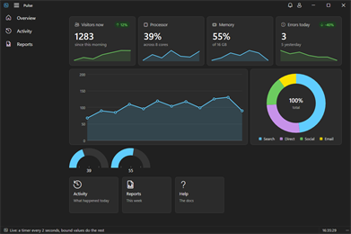<br><b>Dashboard</b><br>Stat cards, charts and gauges fed by a timer</td>
</tr>
<tr>
<td align="center">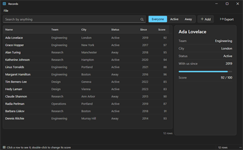<br><b>Data grid</b><br>A searchable table with a details panel</td>
<td align="center">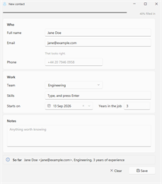<br><b>Form</b><br>A contact form that checks itself</td>
<td align="center">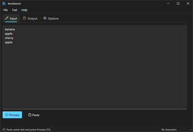<br><b>Tabbed window</b><br>A text workbench in tabs</td>
</tr>
<tr>
<td align="center">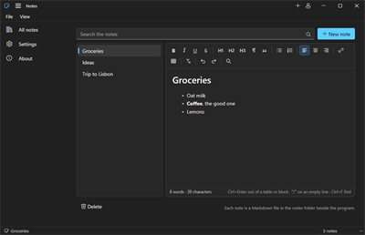<br><b>App shell</b><br>A notes app with a folding page rail</td>
<td align="center">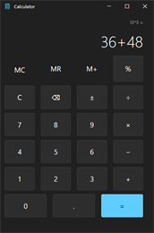<br><b>Calculator</b><br>Fills its window, takes the keyboard</td>
<td align="center">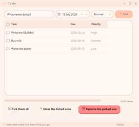<br><b>To-do list</b><br>Tasks run entirely by rules</td>
</tr>
<tr>
<td align="center">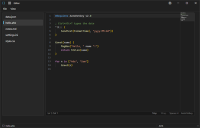<br><b>Split editor</b><br>A code editor beside a file list</td>
<td align="center">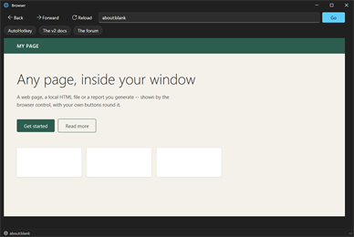<br><b>Embedded browser</b><br>Back, forward, address bar, bookmarks</td>
<td align="center">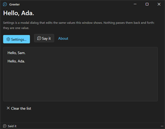<br><b>Two windows</b><br>A main window, a dialog and an About box</td>
</tr>
<tr>
<td align="center">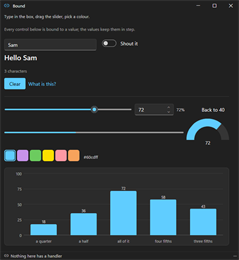<br><b>Bound to a value</b><br>No handler code at all</td>
<td align="center">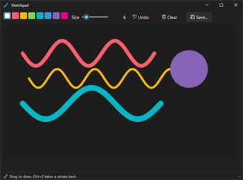<br><b>Sketchpad</b><br>A canvas to draw on, with colours, undo and save</td>
<td align="center">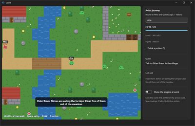<br><b>Quest</b><br>A small top-down adventure game</td>
</tr>
</table>

Templates are ordinary project files in `studio/templates/`. To add your own,
save a project there. The number at the front of the name sets the order, and
a `.png` with the same name becomes its picture.

## Finding your way around


Seven workspaces run across the top, each a different view of one program.

| Workspace | Key | What you do there |
|---|---|---|
| **Design** | **Ctrl+1** | Lay out windows: canvas in the middle, Toolbox and Outline on the left, inspector on the right |
| **Logic** | **Ctrl+2** | Values, bindings, rules, states, hotkeys, timers, macros, menus |
| **Steps** | **Ctrl+3** | One piece of code as a flowchart you change without typing |
| **Code** | **Ctrl+4** | The same piece as code, with every piece of code listed beside it |
| **Map** | **Ctrl+5** | The whole program: what starts things, what they do, what they touch |
| **App** | **Ctrl+6** | Windows, files, libraries, how the program starts and is built |
| **Look** | **Ctrl+7** | Themes |

The title bar holds the menus, back and forward (**Alt+Left**,
**Alt+Right**), one search box for every command and place
(**Ctrl+Shift+P**), the problem count, **Try it**, **Live** and **Run**.
**Problems** and **Output** live in a panel along the bottom (**Ctrl+J**).

The inspector has three tabs: Properties, Layout and Events. Click any step of
the path along its top to select that container. With nothing selected it
shows the window's own settings. **Ctrl+B** and **Ctrl+Shift+B** hide the side
panes, as does a double-click on a pane's divider.

## Adding things

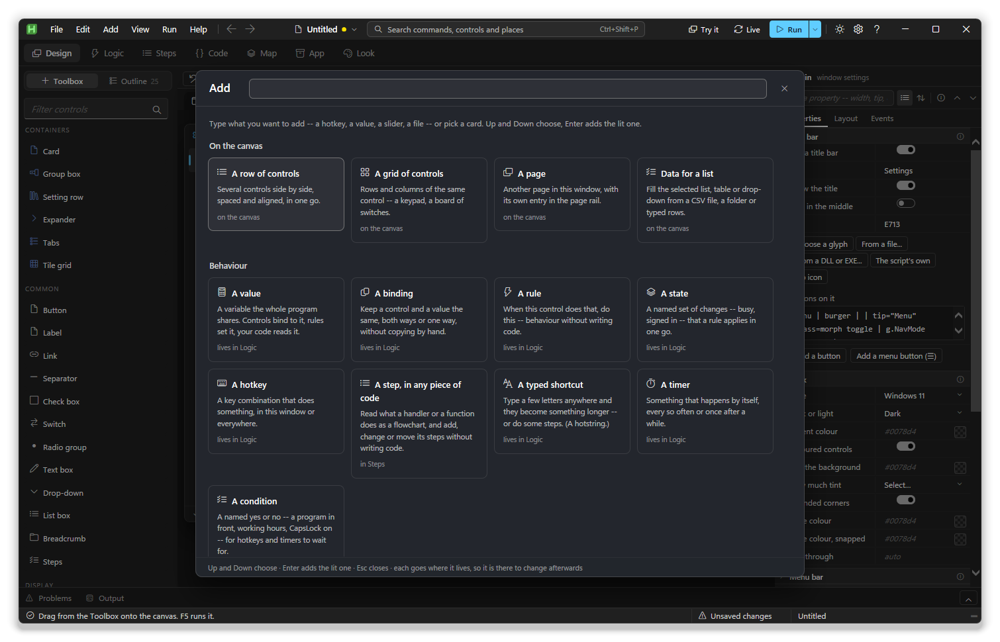

Everything you can add is in one gallery: **Ctrl+I**, the **Add** button, or
**Add > Anything**. Type to search ("slider", "key", "ini"), **Up** and
**Down** to choose, **Enter** to add. Each form shows the line or code it will
write before it writes it.

Each card says where the new thing will live, and the studio takes you there
first. Every row in those lists ends in **Edit** and **Remove**, and
**Ctrl+Z** brings back anything you removed.

## Designing a window

### Gestures

| Gesture | What it does |
|---|---|
| Drag from the Toolbox | Adds that control where the caret shows |
| Click a Toolbox item | Adds it at the current selection |
| Drag a control | Moves it; the caret shows where it will land |
| **Alt** while dragging | Free placement at an exact `x`, `y`, with snapping |
| **Ctrl** while dragging | Drops a copy |
| **Shift** while dragging a free control | Puts it back into the flow |
| Drag on empty space | Selects everything inside the box |
| **Ctrl**+click or **Shift**+click | Adds or removes one control from the selection |
| Drag a row in the Outline | Moves a control, even to another page |
| The eight grips | Resize |
| The blue corner of the window | Resizes the window |
| Double-click a control | Opens its first event's code |
| Right-click a control | Cut, copy, paste, placement, a popover and more |
| **Alt** + point at a control | Shows its size and the gap on each side |
| **Esc** while dragging | Cancels the drag |

Snapping goes to other controls' edges and centres, then to the grid; the
pink lines show what it caught.

### Placing and sizing

A control sits **on a new line**, **on the same line** as the one before,
**free** at an exact position, or **docked** to an edge (top, bottom, left,
right or fill). Docking keeps a footer at the bottom while the page scrolls.

- **Width** is set against the box it sits in: as wide as it needs, the rest
  of the line, half, a third, a quarter, or exact pixels. Blank means natural
  size.
- **Fill the height** makes a list, editor or card take the height the page
  has left and follow the window as it resizes.
- **Arrange what is inside...** lays out a container's controls in one go: in
  a column, in a row, in a grid, or as label-and-box pairs.
- **Group** on the toolbar wraps the selection in a card, group box, expander,
  tabs or tile grid. **Align** lines up edges and centres and evens out gaps.
- **Tab order** on the toolbar: click controls in the order **Tab** visits
  them.
- **Fit to what it holds** (under the window's Height) sizes the window to its
  content.

With several controls selected, layout and shared properties apply to all.

### The Actions row

Under the properties of whatever you select is a short row of what you are
most likely to do next. Each one writes real controls or code, as one undo.

| Selected | Offered |
|---|---|
| Page, card, group box, expander, tabs | A row of controls, a heading, an OK / Cancel bar; another page or tab |
| Button, link | Make it the accent button, add a Cancel, close the window, open a web page |
| Label | Make it a heading or a hint |
| Check box, switch, slider, progress bar | Turn another control on and off, show the value in a label, drive it from a timer |
| List, table, drop-down, autocomplete | Add and sort options, fill it with data, fill suggestions from code |
| Image, splitter, drop zone, log box | Choose a picture, choose what it resizes, handle drops, add an `AppendLog()` |
| Anything you type or pick in | Put a label above it, remember it between runs |
| Anything | Write its handler, wrap it in a card, duplicate, delete |

**Remember it between runs** writes an `IniRead` into the startup code and an
`IniWrite` into the change handler, using `settings.ini` beside the script.

### Filling a list with data

**Fill it with data...** (on the Actions row, or **Data for a list** in the
gallery) builds a list's contents for you. It takes cells pasted from a
spreadsheet, rows you type, JSON, a CSV file read at run time, or a folder
listing. The last two write a function into your code, since the work happens
when the script runs. For a data grid, **Edit the data...** opens a
spreadsheet where you change columns and rows directly.

### Icons and popovers

Every icon field has **Choose an icon**: a grid of glyphs you search by
meaning, so "delete", "trash" and "bin" find the same one. The window's own
icon can also come from a file, a DLL or EXE (`shell32.dll,13`), or the
script.

Any control can carry a **popover**, a small panel that opens from it.
Right-click and choose **Give it a popover**, or fill in the **Pop-up panel**
group. Anything with an id inside it works with `On()` and `Value()` as usual.

### The window itself

Select nothing, and the inspector shows the window's settings: size, title
bar, where it opens, keys and closing, pages, look, menu bar, status bar and
the frame (maximise button, rounded corners, always on top, opacity, whether
closing it ends the script). Turn off the page rail and controls sit directly
on the window, which suits a dialog.

The menu bar, status bar and title bar items are one per line:

```
Menu bar                              Status bar
&File                                 msg | Ready | grow icon=E930
    &New | Ctrl+N | g.Toast("New")    pos | Ln 1 | w=120 right
    -
    E&xit | Alt+F4 | g.Close()        Title bar
&Help                                 menu | burger | | tip="Menu" class=morph
                                      acct | glyph | E77B | right
```

A menu item's third field is code: a one-liner goes inline, anything longer
becomes a function.

## More than one window

A project can have several windows. The **+ Window** tab above the canvas
adds one; double-click a tab to rename it, right-click it for the rest.

| Kind | In the exported script |
|---|---|
| `main` | Built at the top of the script |
| `window` | `ShowName()`: built once, brought to the front if already open |
| `dialog` | `r := ShowName()`: modal, returns a `Map` of what it gives back |
| `tool` | Like a window, framed as a small tool panel |

The window's name is its function's name, and renaming it updates every call.
To pass data, fill in **Takes** and **Gives back** in its settings:

```
Takes                  Gives back
who = "World"          who  = whoBox.Text
                       loud = loudSwitch.Checked
```

To open one window from another, right-click its tab, choose **Open it
from...**, and pick a button. **App > Windows** flags any window nothing
opens.

## Logic

Logic lists what your program does. **Up** and **Down** move between
sections, and every section has **Edit as text** if you prefer typing lines.

| Section | What it holds |
|---|---|
| Values | Variables the whole program shares |
| Conditions | Named yes-or-no questions: Notepad is in front, it is working hours |
| Typed shortcuts | Hotstrings: a few letters that become something longer, or run steps |
| Timers | Things that happen every so often, or once after a while |
| Macros | Keys, clicks and waits, played back |
| Settings | What your program remembers between runs |
| In Windows | A window opens, the clipboard changes, the screen locks, a drive arrives |
| In a folder | A file appears, changes, goes or is renamed |
| Bindings, Rules, States | Per window: see below |
| Hotkeys | Key combinations, in this window or everywhere |
| Menus | Right-click menus and the menu bar |
| Code | The window's startup code and your own functions |

Anything that names something missing shows up in red, and clicking a row
takes you to the control it names.

### Binding a control to a value

A rule happens once. A binding keeps a control and a value the same, all the
time.

```
Values (the project)             Bindings (this window)
who = "World"                    nameBox <-> who
loud = 0                         greetLabel.Text <- greeting
greeting <- "Hello " who         shoutSwitch <-> loud
```

| Syntax | Meaning |
|---|---|
| `name = value` | A value and what it starts as |
| `name <- expression` | A derived value, worked out again on every sync |
| `ctl <-> var` | Two way: the control shows the value and writes changes back |
| `ctl <- var` | One way: the control only shows it |
| `ctl.Prop <- var` | Bind one property; leave it off for the control's main value |
| `name = {A: 1, B: "x"}` | A thing with fields, one value holding several |
| `ctl <- name.Field` | Bind a control to one field of it |

Values are plain AutoHotkey globals, and two windows can share one. From your
own code, change a value and call `AxBindSync()` so every bound control
catches up. A sync only writes a control whose value has changed, so calling
it often costs nothing for what stayed the same.

**A value can hold fields.** A game character is a good example:

```
Values                                               Bindings
Hero = {Name: "Aria", HP: 20, MaxHP: 20, Gold: 0}    nameBox <-> Hero.Name
HpPct <- Round(Hero.HP * 100 / Hero.MaxHP)           hpBar <- HpPct
GoldLine <- Hero.Gold " gold"                        goldText.Text <- GoldLine
```

**Add a value...** has a third kind, *A thing with fields*, where you list one
field per line. The Values table shows each field as a chip. Bindings and
rules offer `Hero.Name`, `Hero.HP` and the others in their pickers. In your
code, `Hero.HP -= 2` then `AxBindSync()` updates the health bar.

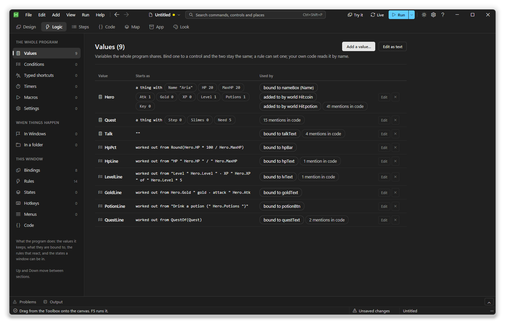

### Rules and states

```
Rules                                 States
saveBtn Click -> state busy           busy: saveBtn.Enabled = 0, bar.Visible = 1
saveBtn Click -> toast "Saved"        idle: saveBtn.Enabled = 1, bar.Visible = 0
nameBox Change -> enable saveBtn
helpLink Click -> open Help
```

A rule is `control Event -> verb what`, and **Add a rule...** builds one for
you. A state is `name: ctl.Prop = value, ...`. Rules run before any code you
write for the same event.

| Verbs | What they do |
|---|---|
| `toast "text"`, `status part "text"` | A notification, a status bar part |
| `open Window`, `close`, `page name` | Open a window, close this one, show a page |
| `dirty`, `clean` | Mark the window as having unsaved changes, or as saved |
| `show ctl`, `hide ctl`, `enable ctl`, `disable ctl` | Show, hide, or turn a control on or off |
| `set ctl value`, `copy a b` | Set a control, copy one to another |
| `assign var value` | Change a value, so everything bound to it follows |
| `add var n`, `take var n` | Add to a value or take from it: by 1, a number, or another value (`add Hero.Gold 5`) |
| `do code` | One line of AutoHotkey, as written |
| `state name` | Apply a state |
| `run "thing"`, `send keys`, `type "text"` | Run a program or page, send keys, type text |
| `start timer`, `stop timer`, `play macro`, `call Fn` | Timers, macros, your functions |
| `beep`, `wait ms` | Beep, pause |
| `save settings`, `load settings`, `reset settings` | The program's remembered settings |
| `addrow`, `removerow`, `clearlist`, `tickall`, `untickall` | Change a list's rows; `{box}` means what `box` holds |
| `saverows`, `loadrows`, `folderrows` | Save rows to a file, load them, list a folder |

Use `assign` rather than `set` on a bound control: setting a control from code
fires no Change event, so the binding would not notice. Installed libraries
can add verbs of their own.

**A control's own events.** Some controls bring events of their own. The Game
view has `Tick`, `Hit` and `Key`, and they appear in its Events tab like
Click does. A rule on one of them gets the event's own values, and it can be
narrowed to one of them with **only for**:

```
world Hit:coin -> add Hero.Gold 1                 when the hero touches a coin
world Hit:coin -> do Pickup(eng, b, "+1 gold")    b is the coin, eng the game
world Key:space -> do Attack(eng)                 Space pressed
```

`Hit:coin` runs only when the thing hit is tagged `coin`, and `Key:space` only
for Space. The handler's own names (`eng`, `a`, `b`, `tag`, `key`) can be
used in a `do` line.

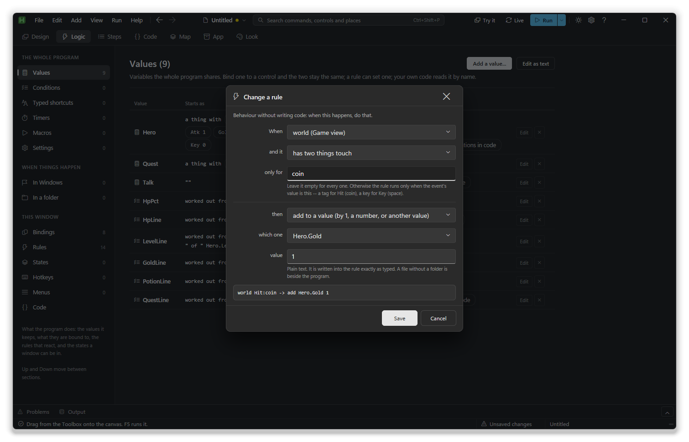

### A game in the studio

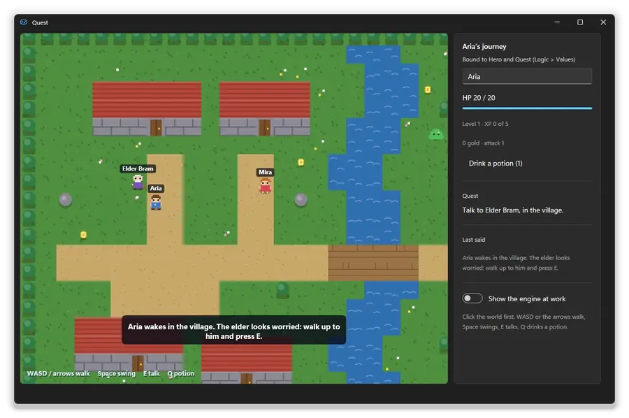

The **Quest** template is a small adventure. Aria wakes in a village, the
elder asks her to clear the slimes out of the meadow, and his key opens a
grove with a chest in it. It uses most of what the studio does:

- **The world** is a Game view in its 2D mode. Its start-up code builds the
  map, the people and the slimes in a few dozen lines. The world's `Tick`
  event handles time passing: the talk box fading and slimes coming back.
- **The hero and the quest are values with fields** (`Hero`, `Quest`). The
  panel on the right is bound to them: health bar, level, gold, the potion
  button's label, the quest line and what was last said. The name box is
  bound both ways, so renaming Aria renames the sprite's label too.
- **Rules** handle picking things up (`add Hero.Gold 1`, then take the coin
  away) and decide what Space, E and Q do.
- **The code** covers who says what, fighting, the gate and the chest. Each
  function changes `Hero` or `Quest` and calls `AxBindSync()`. None of them
  touches the panel.

Press **F5** to play: click the world, then WASD or the arrows to walk, Space
to swing, E to talk and Q to drink a potion. See [the Game view](components.md#the-2d-world)
for what the engine itself can do.

**Asking before it closes.** In the Window tab, **Keys and closing** has
three settings:

- **Before it closes:** *Just close*, *Ask to save unsaved changes* or
  *Always ask*.
- **Saved by:** the function in your code that saves.
- **And asks:** a function of your own, `Fn(win, why)`, that can keep the
  window open by returning true.

It works however the window is closed: its button, its icon, Alt+F4, the
taskbar, or the tray's Exit. The rule verbs `dirty` and `clean` mark unsaved
changes, as does `g.Dirty := true` in code, and the title shows a dot
meanwhile. The **Quick note** template works this way: `note Change -> dirty`,
and closing with changes asks whether to save.

### Hotkeys, timers, events and the rest

Each has one form. **A hotkey** records the keys you press and asks where it
works: this window, everywhere, or while another program is in front. What
they all do is written as steps, in the same words as rules. A hotkey, typed
shortcut or timer can wait for a condition, such as "only while Notepad is in
front".

**In Windows** reacts to the program starting or ending, a window opening,
closing or coming to the front, the clipboard, the screen locking, sleep and
wake, drives, Windows switching dark or light, and the user going idle.
**In a folder** watches for files being added, changed, removed or renamed.
Steps can use what happened: `{text}`, `{window}`, `{file}`, `{name}`,
`{drive}`.

### Macros

A macro plays back keys, text, clicks, scrolling and waits. Start it from a
hotkey, a typed shortcut, a timer, a rule (`play name`) or code
(`Macro_name()`); **Esc** stops it. Build it with the buttons under it, or
press **Record...**, do the thing, and press **F12** to stop.

Steps can branch (`if window ...`, `else`, `end`) and `stop` ends the macro.
**Pick an element...** lets you point at a button or box in any program
(**F8** keeps it); the macro then clicks it, types into it, waits for it or
reads it, finding it fresh each time. This uses Descolada's UIA library, which
the studio offers to install.

### Settings and menus

Each **setting** is saved to a small `.ini` and is also a value you can bind,
set or read. A **Start with Windows** setting makes and removes the Startup
shortcut for you.

**Menus** holds right-click menus and the menu bar; the tray's menu is under
**App > Tray icon**. Each menu is drawn as it will look. Click an item to set
its text, picture and shortcut, and what it does: show the window, open
another, cut, copy, paste, flip a value, run a step or code, quit.

## Steps

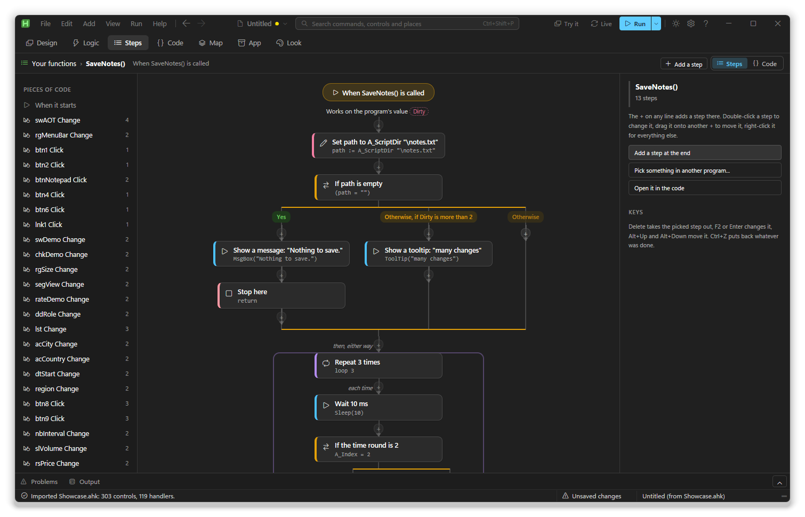

Steps shows one piece of code as a flowchart: a handler, startup code, one of
your functions, a hotkey. Pick it from the list on the left, or double-click a
card on the Map. Each box says in words what the statement does, with the code
under it. An `if` splits into side-by-side branches; a loop holds what it
repeats.

To add a step, click the **+** on any line, pick a kind (a message, change a
value, only if..., repeat, wait, send keys, open a program, a file, another
window, a library, a function, or plain code), and answer what it asks.

| In Steps | What it does |
|---|---|
| **+** on a line | Adds a step there |
| Double-click, **F2** or **Enter** | Changes the picked step |
| Drag a step onto a **+** | Moves it |
| Right-click | Before, after, copy, wrap in "only if", move out |
| **Alt+Up** / **Alt+Down** | Moves the picked step |
| **Delete** / **Ctrl+Z** | Removes it / undoes |

Changes go into the code text itself, so your comments stay put. **Ctrl+4**
shows the same piece as code.

## Code

The Code workspace lists every piece of code by window: startup code, your own
functions, each handler, and the whole generated script (read only).

The editor colours AutoHotkey and completes as you type after a dot; `g.`
offers exactly what your copy of AxGui has. **Tab** indents, **Ctrl+/**
comments, **Ctrl+Space** completes. **Check syntax** runs the code through
AutoHotkey's own parser, and **Insert a snippet** drops in ready lines, your
libraries' included. Handlers can use `g` and every named control directly.

**A script helper** in the gallery writes the AutoHotkey a real script keeps
needing, and shows you the result first:

| Group | Helpers |
|---|---|
| Keys and typing | Abbreviations, remaps, pasting through the clipboard, tap versus long press |
| Windows and apps | Wait for a window, notice one open or close, read a command's output, run a program once |
| Screen and mouse | List monitors, centre on the one under the mouse, read the colour under the pointer |
| Listeners | Clipboard, devices, screen layout, dark or light mode, saving on exit, catching every error |
| Time and timers | Repeating, settle-then-act, a time of day |
| Tray and alerts | A tray menu, a Windows notification with buttons |
| Files and settings | An ini beside the script, watching a folder, files dropped on the window |
| The script itself | One copy only, restart as administrator, start with Windows, the command line |

## Map

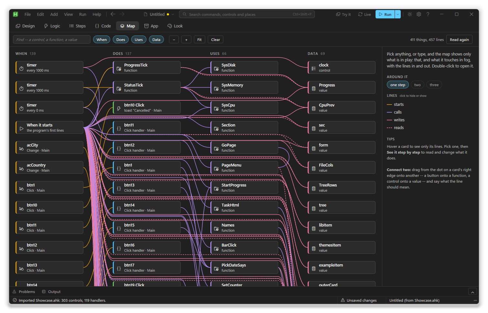

The Map lays out your whole program in four columns: **When** (events, rules,
hotkeys, timers), **Does** (what they run first), **Uses** (what that calls)
and **Data** (the values and controls read and written). It is read from the
real code.

- Click a card to see only it and what it touches. **Around it** widens that.
- Type in the find box to filter. **Esc** or **Clear** shows everything again.
- Double-click a card, or choose **See it step by step**, to open it.
- Drag the dot on a card's right edge onto another card to connect them: a
  button onto a function becomes a rule, a control onto a value a binding.

## Look

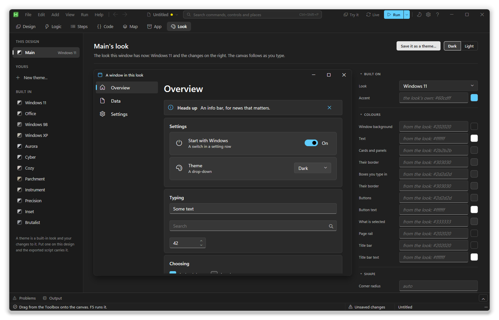

The rail lists this design's look, your own themes, and the built-in looks:
Windows 11, Office, Windows 98, Windows XP, Aurora, Cyber, Cozy, Parchment,
Instrument, Precision, Inset and Brutalist. The middle shows a sample window;
the right is everything you can change, and the canvas follows as you type.

- Set colours for the background, text, cards, boxes, buttons, selection,
  page rail and title bar, plus corners, font and spacing.
- **Your own CSS** covers the rest: `body` for the window, `.card`, `.btn` or
  `#sidebar` for its parts.
- **Save it as a theme...** keeps the look for other designs. Built-in looks
  are not edited in place: **Make a theme from it** copies one first.

Changes sit on top of the built-in look, and the export carries them as one
`SetExtraCss` call. See [themes](themes.md).

## App

App is the program as a whole: **Windows**, **Details** (the exe's name,
version, icon, and what happens if it is started twice), **Build**, **Files**,
**Libraries**, **Code files** (other `.ahk` files to include), **Extra
controls**, **Command-line options**, **Ways to start**, **Tray icon** and
**Script settings**.

### Files the program needs

**App > Files** shows each file as a card with its size, whether it is there,
and which code uses it. **Add files...** takes several at once. Choose how the
finished program gets each one:

| How | Writes | Keep in mind |
|---|---|---|
| Carry it, write it out on first run | `FileInstall` | For anything that must be a real file |
| Carry it, read it from memory | `;@Ahk2Exe-AddResource` | You get the contents, not a path |
| Look for it beside the program | A path at run time | The file has to be there |

Each file becomes a function, `File_<name>()`, so your code works the same
either way, compiled or not. The studio also offers to add files your code
opens by name.

### Libraries

**App > Libraries** is a store of other people's AutoHotkey code: every
library in [Aris](https://github.com/Descolada/Aris), Descolada's package
manager, sorted by category with recommended ones first. Libraries that build
their own windows are hidden.

Aris downloads the first time you ask (about 2 MB, into
`studio\data\aris`). Libraries install into your project's `Lib\Aris\`
folder, so the project still runs when copied elsewhere. Once installed, a
library's functions show under **What it offers**, the editor completes them,
the gallery finds its snippets, and rules and Steps gain its steps (such as
`json.read notes notes.json`). **Stop including it** keeps it installed but out
of the script.

**Refresh the list** fetches Aris's list of libraries again. **Check for
updates** looks for newer versions of this project's libraries on GitHub
(AHK# among them when the project uses it), and of Aris itself. A library with
a newer version is marked in the list, its button reads **Update to 1.2.3**,
and **In this program** has **Update all**.

### .NET, through AHK#

The **.NET, through AHK#** tab lets your script use .NET Framework 4: speech,
zip, the web, dates and more, plus NuGet packages built for .NET Framework
4.x or .NET Standard. **Get AHK#** installs the small library it needs.

Any .NET method, or any library function (**Make it a step**), can become an
**adaptor**: a plainly named function that rules and flowcharts use as a step.
A compiled program needs AHK#'s bridge DLL beside it; **carry it with the
program** adds it to Files.

### Extra controls

**App > Extra controls** lists each component pack. Click a control to see it
live, how you write it in code, and its properties and events. The export
includes only the packs your design uses. **More controls, from a pack** in
the gallery installs one from a `.zip` or folder. See
[components](components.md).

### Starting options, tray and script settings

A **command-line option** becomes a global of the same name: `--name value`,
or `--name` alone for a flag. A **way to start** is a named mode, picked with
`--mode name` or `Mode(name)`, whose steps use the rule words:

```
quiet | hide, toast "Started in the background"
setup | page pageSetup, state firstRun
```

**Tray icon** sets the icon, tooltip, menu and click. Turning it off writes
`#NoTrayIcon`. **Script settings** are plain sentences such as *Run as
administrator*, *Start with Windows* or *Keep typing private*.

## Running and testing

**Try it** (**F6**) makes the canvas live: the controls work, and nothing is
exported or run. **F6** or **Esc** goes back to editing.

**Run** (**F5**) exports the script and starts it as its own program. While it
runs from the studio:

| When you | You get |
|---|---|
| Click a control in the running window | It is selected in the studio |
| Call `AxLog(anything)` | The text in **Output** |
| Hit an unhandled error | File and line in Output; click it to open that handler |
| Run it again | The window comes back where you left it |

**Live** runs it again a moment after each change. Only the copy the studio
started is ever stopped. **Run > Check every handler** checks all the code at
once. If the studio itself trips up, the error goes to the status bar and
`studio\data\studio.log` (**Help > Open the studio log**).

## Problems

Problems are checked on every change, and the count sits on the tab. Click a
row to go to the cause. Export checks too, offering **Show me**, **Export
anyway** or **Cancel**.

| Problem | Why it matters |
|---|---|
| Two controls with one name, a name AutoHotkey cannot use, or one a generated function has | The script will not load |
| Code calling `ShowThat()` for a deleted window, or a library that is not installed | The script will not start |
| Two handlers for one event, an empty one, or one on a control with no name | It is not wired, or does nothing |
| A rule, binding, splitter or menu naming something missing | It does nothing |
| A control outside its window, or free controls on top of each other | You will not see it |
| A window nothing opens, or two menus on the same Alt key | It cannot be reached |
| No tray icon and no way to close | Only Task Manager can stop it |

## Saving and exporting

| Command | Writes |
|---|---|
| **File > Save** (**Ctrl+S**) | `.axs.json`, the project |
| **File > Export** (**Ctrl+E**) | `.ahk`, a script that runs on its own |
| **Export script as...** | The same, to a new file |
| **Export node table** | `.tsv`, one row per control, for a spreadsheet |

A new project offers somewhere to save straight away. Autosave keeps a spare
copy in `studio\data` and a `.bak` beside your file; **File > Recover
the last autosave** brings it back after a crash.

You can edit the exported script by hand and keep using the studio. What the
studio writes sits between `;#region axstudio` markers, and exporting again
refills only those, so your own includes, hotkeys and functions stay. Handler
code you changed in the file is read back, and the studio offers to take it.
It never overwrites a file it did not write without asking.

The line `; @axstudio project="Thing.axs.json"` near the top lets **File >
Open** go from the `.ahk` to its project. See
[generated code](generated-code.md) for what the export contains.

## Importing a script

**File > Import a script...** turns an existing `.ahk` into a project. It
reads windows built with AxGui or AutoHotkey's own `Gui()`, without running
the script. A `Gui()` window keeps every control where the script put it; set
**Controls sit > In rows that resize** in the window's settings to make it
resize.

A wizard then offers what the script does, one tick per kind: hotkeys,
typed shortcuts, remaps, timers, values, script settings, the tray, clipboard
and exit events, carried files. Simple handlers become rules and the rest
stays as code. A script with no window gets one that starts hidden. Your
original file is never changed.

## Compiling to an exe

**File > Compile...** (or **App > Build**) holds everything about the exe, and
**Compile it now** exports and builds it with Ahk2Exe. What Ahk2Exe says goes
to **Output**.

| Group | Settings |
|---|---|
| What it says it is | Name, description, version, company, copyright, icon |
| The build | Output name, the AutoHotkey it is built on, compression, administrator rights |
| What goes in | Extra controls used, the library's own files, your files, prerendering |
| The compiler | Where Ahk2Exe is |

It is all written as `;@Ahk2Exe-` lines, so compiling another way works too.

- The studio finds Ahk2Exe beside AutoHotkey, in the registry or in Program
  Files, and remembers where. If it is missing, **Get it** opens the download
  page.
- **Built on** picks 32- or 64-bit, and the `_UIA` builds can work elevated
  windows.
- **The library's own files** are the stylesheets and pictures the window
  needs. **All of them** adds under 1 MB; **Only what this design reads** is
  smaller, but a miss shows as an unstyled window.
- **Prerender the window** makes the exe open a little faster the first time.
  Export again after changing the window.

## Updates

**Help > Check for updates** (also on the title bar's help card, and in
About) lists what you have and the newest there is:

- **AxGui and AxStudio.** Read from `version.json` in
  [owhs/axahk](https://github.com/owhs/axahk). This copy is AxGui 1.0 and
  AxStudio 0.9. A newer one opens the release page; nothing is replaced for you.
- **Aris.** The version in its own `package.json`, here and on GitHub.
  **Get the new Aris** downloads it again.
- **Aris's list of libraries.** Fetched again.
- **This project's libraries.** Each one's newest release or version tag on
  GitHub, against what the project's `package.json` says is installed.
  **Update** runs `aris update` for each, one after another. A library
  installed from a branch can't be compared, so it says so.

Nothing is downloaded or run until you pick a button. Without the internet,
each line says it got no answer.

## Studio settings

**File > Settings** is kept in `studio\data\studio.ini`, beside the studio,
along with the autosave, the log and the library caches. Nothing goes in your
profile, so the studio folder is portable. If that folder can't be written to,
say in Program Files, the studio uses `%AppData%\AxStudio` instead. A studio
that used to keep its settings in `%AppData%` copies them across the first time
it starts; you can delete the old folder afterwards.

| Setting | What it changes |
|---|---|
| The studio | Dark or light editor; your design keeps its own look |
| Toolbox shows icons only | Fits about three times as many in |
| The canvas | Grid, grid size, snapping, alignment guides |
| Autosave | How often (0 is off), and whether it writes your file or a spare copy |
| Live re-run waits | How long typing must stop before Live runs again |
| The preview opens | As designed, or where and as big as the last run |
| Starting up | The start screen, offering somewhere to save |

## Keys

**F1** shows these in the studio.

| Anywhere | |
|---|---|
| **Ctrl+1** ... **Ctrl+7** | Design, Logic, Steps, Code, Map, App, Look |
| **Alt+Left** / **Alt+Right** | Back and forward |
| **Ctrl+I** | Add anything |
| **Ctrl+Shift+P** | Every command, control, template and recent project |
| **Ctrl+P** | Go to a window, page or control |
| **Ctrl+J** | Problems and Output |
| **Ctrl+B** / **Ctrl+Shift+B** | Toolbox and Outline / inspector |
| **Up** / **Down** | Next section, in Logic and App |
| **F5** / **F6** | Run it / try it on the canvas |
| **Ctrl+S** / **Ctrl+E** | Save / export |
| **Ctrl+Z** / **Ctrl+Y** | Undo / redo |
| **Enter** in a form | Its first button (**Ctrl+Enter** in a multi-line box) |

| On the canvas | |
|---|---|
| **Delete** | Remove |
| **Ctrl+C** / **Ctrl+X** / **Ctrl+V** / **Ctrl+D** | Copy, cut, paste, duplicate |
| **Ctrl+A** | Select everything on the page |
| Arrows | Nudge, or move within the flow |
| **F2** / **Enter** | Rename / open its code |
| **Shift+F10** | Its menu |
| **Esc** | Select what holds it, then nothing |

## More

[Generated code](generated-code.md) explains what the export writes,
[the library guide](guide.md) covers AxGui without the studio,
[components](components.md) and [themes](themes.md) describe the controls and
looks, and [extending](extending.md) shows how to add a control, template,
theme, action or rule verb to the studio.
