# Themes

Every window has three settings that decide how it looks:

- **the stylesheet**: the whole look (Windows 11, Windows 98, Cozy...);
- **the theme**: dark or light, or whatever Windows is set to;
- **the accent**: the colour of buttons, switches, selection and links.

```ahk
g := AxGui({Stylesheet: "cozy", Theme: "light", Accent: "#10893e"})
g.SetStylesheet("cyber"), g.SetTheme("dark"), g.SetAccent("#ff8c00")   ; any time, live
```


## The stylesheets

Each picture below is the same window, dark on the left and light on the
right.

### Windows 11 · `win11`

The default: Fluent as Windows 11 draws it. Flat surfaces, soft rounded
corners, the Segoe UI Variable font.

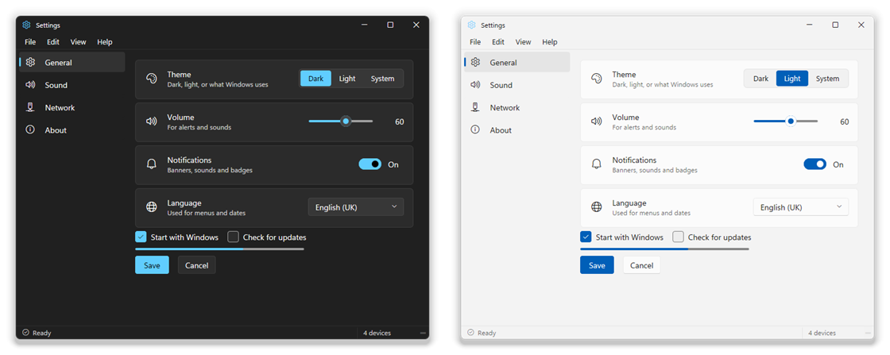

### Microsoft 365 · `win365`

Fluent the way Office apps wear it: a painted brand band across the top with
the title centred, a white navigation pane, warm neutral paper and cards that
lift with a shadow. The accent is the brand colour, so one `SetAccent`
repaints the band, the live page, the buttons and the selection together.
Give a title-bar search box `Class: "axtb-search"` for Office's search pill.

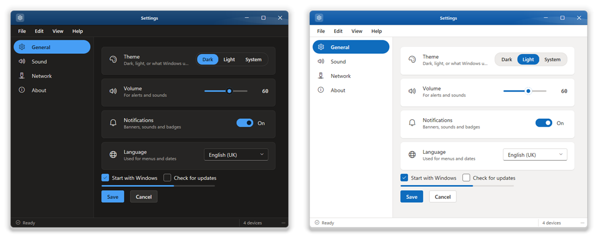

### Windows 98 · `win98`

Grey 3D bevels, navy title bar, MS Sans Serif, dotted focus rectangles and
yellow tooltips. There's a dark version too, with the same bevels inverted.

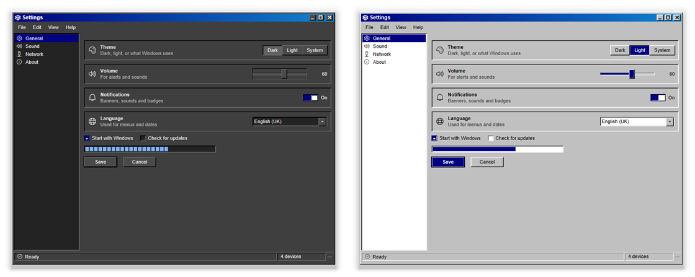

### Windows XP · `winxp`

Luna: the blue title bar with its red close button, the beige dialogs and the
green progress bar.

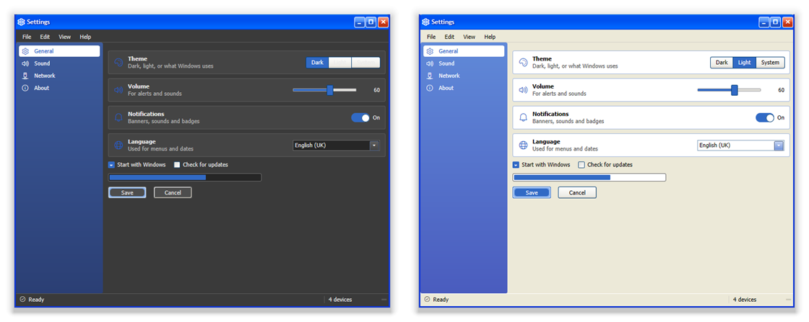

### Aurora · `aurora`

Dark first, with depth: an accent glow behind the page, thin glassy panels,
and glows instead of borders to show what's focused.

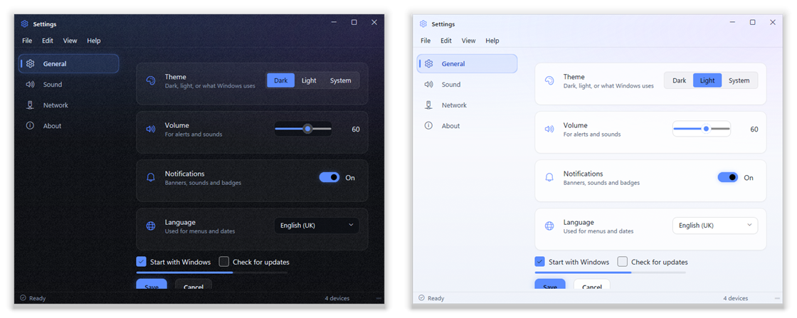

### Cozy · `cozy`

Soft and friendly: everything is round, buttons are chunky and press down
when you click them, shadows are warm and transitions have a little bounce.
The accent is coral.

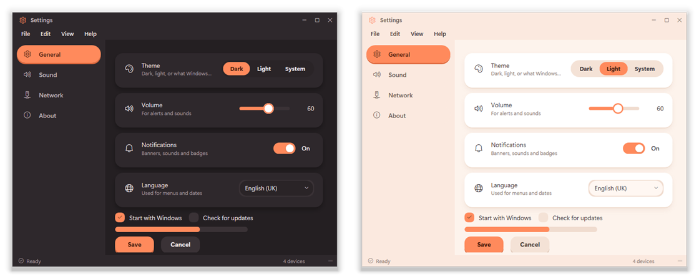

### Cyber · `cyber`

A heads-up display: cut corners, bracket marks, scanlines, uppercase headings,
and one signal colour (the accent) for whatever is live. Progress bars count
up in segments.

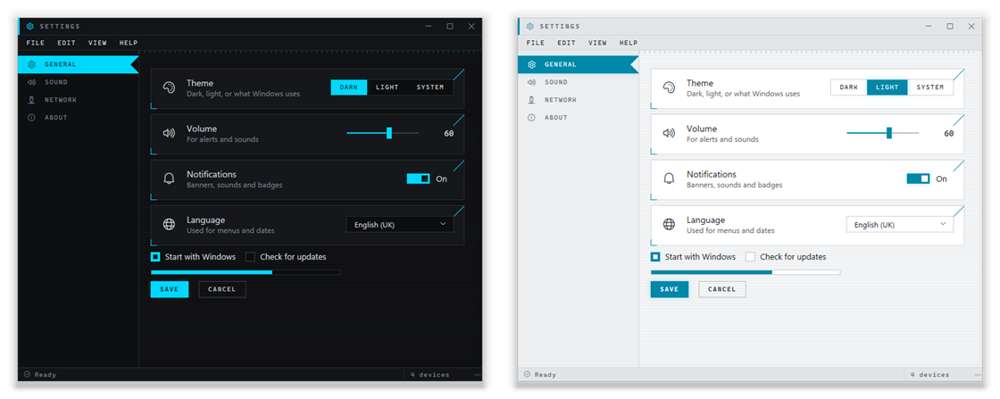

### Parchment · `rpg`

Parchment, tooled leather and gilt, and the only serif stylesheet. Buttons
are raised plaques that press into the wood; fields are cut into the page.
The accent recolours the leather and the gilt together.

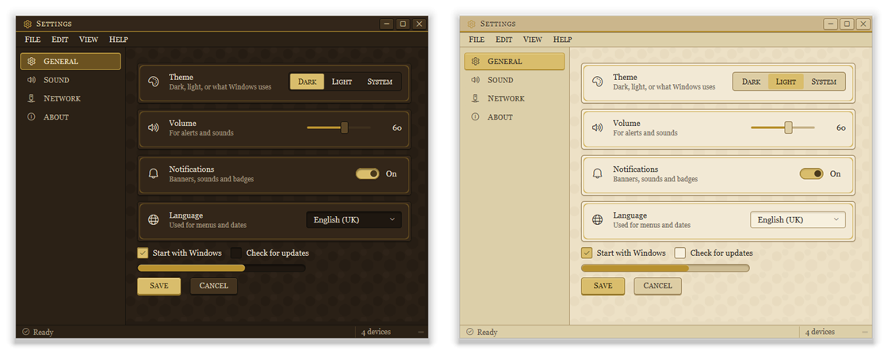

### Instrument · `instrument`

Deep graphite and one brass accent, no boxes. Sections are ruled rather than
framed, and the main button is a brass outline rather than a filled block.

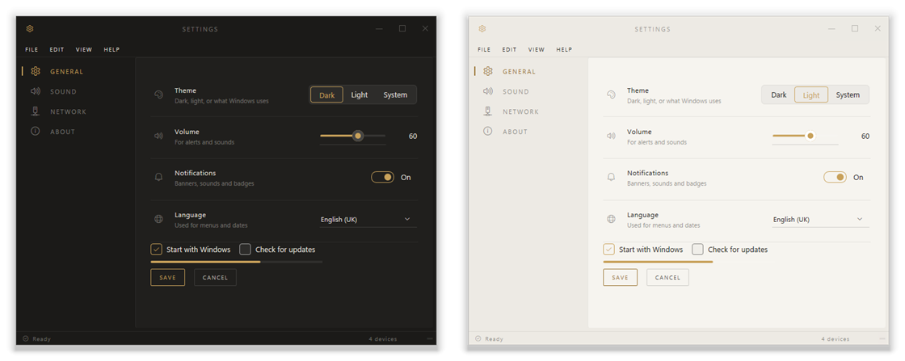

### Precision · `precision`

A micro-chassis: a thin title bar, 1 px dividers, square corners, monospace
labels and data, and the page rail numbered like channels on a panel.

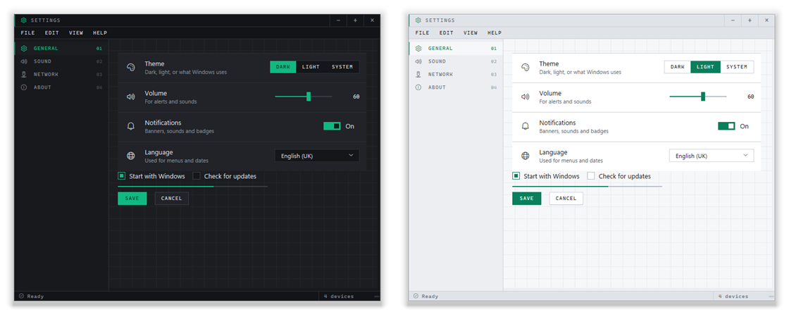

### Inset · `inset`

A modern terminal: everything monospace, panels recessed into channels
instead of floating on shadows.

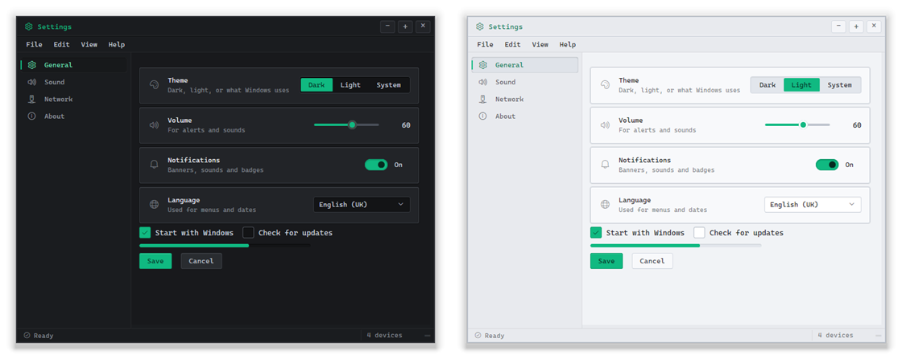

### Brutalist · `brutalist`

Poured concrete and one sheet of glass: a heavy slate rim, crisp structural
lines, a flat workspace and a strip of small telemetry text along the bottom.

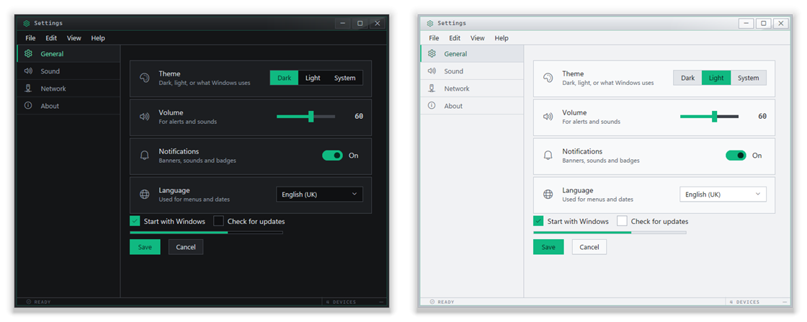

Precision, Inset and Brutalist share a palette: emerald for state and cyan
for the keyboard.

## Accent and tint

`SetAccent("#rrggbb")` recolours the buttons, switches, selection, links and
focus ring. `SetAccent("system")` uses the Windows accent colour, and
`SetAccent("")` goes back to the look's own.

On the stylesheets that paint their own chrome in a fixed colour (Windows 98's
navy, XP's Luna blue, Microsoft 365's brand band), the accent reaches into the
stylesheet itself: every blue in it turns to the accent's hue, keeping its own
lightness, while the reds, greens and greys stay put. Until you choose an
accent, those looks stay exactly as they were.

`SetTint("accent", 0.1)` washes a colour into the window's surfaces: the
background, panels, fields and bars. Give it a colour or `"accent"`, and a
strength from 0 to 1.

`SetExtraCss("mine", css)` adds a stylesheet of your own on top, which is
handy for a few tweaks (`example\Retro.ahk` uses it for the classic Windows
colour schemes). Call it again with `""` to remove it.

## Writing your own stylesheet

The easiest way is to start from an existing one. Put this on the first line
and your sheet only needs to hold what's different:

```css
/* @extends win11 */
```

The library loads `win11.css` first and yours after it. Save the file in
`lib\themes\` and use it by name (`Stylesheet: "mysheet"`), or give a full
path to a `.css` file anywhere.

Some things to know:

- **Scope your rules.** The body carries `sheet-<name>` and `theme-dark` or
  `theme-light`. `win11.css` writes its light rules as `body.theme-light
  .card`, so a bare `.card` in your sheet loses to it. Write
  `body.sheet-mysheet .card`, and add `.theme-light` or `.theme-dark` for
  colours.
- **Bar heights add up.** The page area's height is worked out from the title
  bar (32 px), the menu bar (28 px) and the status bar (24 px). If you change
  one, restate the `#shell` heights too, or the page runs off the bottom.
  `aurora.css` shows how.
- **Let the accent in.** A line like `/* @accent-hue 160 22 */` tells the
  accent to recolour every colour within 22 degrees of hue 160, as well as the
  blues. Keep your greys only slightly tinted so they aren't recoloured with it.
- **Register what it paints.** In `lib\AxGui.ahk`, `SheetAccent` holds each
  look's default accent (light and dark), `SheetSurf` its surface colours for
  the tint, and `RoundSheets` which looks keep the Windows 11 rounded corners.
- **Internet Explorer 11's CSS.** Flexbox, transitions, transforms, `rgba` and
  SVG backgrounds work. CSS grid, `gap`, CSS variables and
  `backdrop-filter` don't. Large gradients band, so the built-in looks use
  small SVG or PNG tiles for texture.

Scrollbars can only be recoloured, not resized or rounded. Setting the four
bevel colours to the track colour gives a flat thumb in a flat channel.

The [inspector](inspector.md) is the quickest way to work on a sheet: its
CSS tab applies what you type as you type it, and saves it to a `.css` file.
In the studio, the Look workspace lets you change a look's colours, corners,
font and spacing without writing CSS at all (see the [studio manual](studio.md)).
