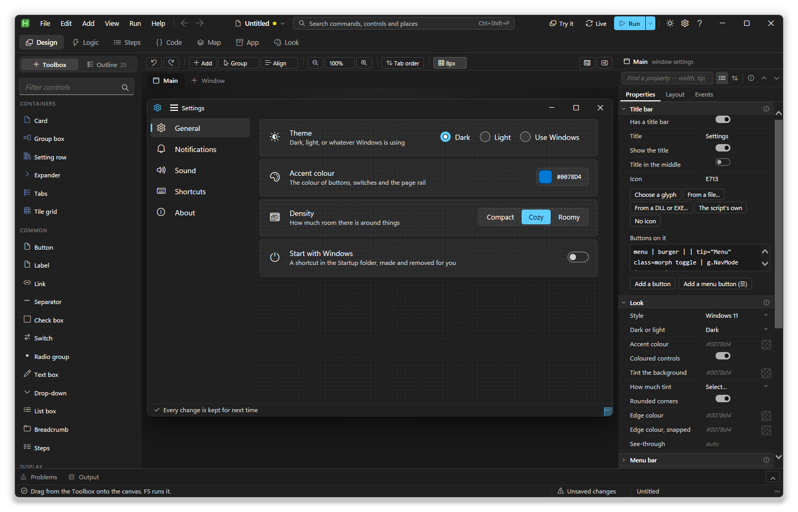

# AxStudio

A designer for AxGui windows, written with AxGui. Drag controls onto a window,
say what they do, and export a `.ahk` that runs on its own.



```bash
"C:\Program Files\AutoHotkey\v2\AutoHotkey64.exe" studio\AxStudio.ahk
```

**The manual is [docs/studio.md](../docs/studio.md)**; see also
[generated code](../docs/generated-code.md) and [extending](../docs/extending.md).

## What is in this folder

Each file opens with a note on how it works. The code editor is the library's
own, in `lib\components\CodeEditor`.

```
AxStudio.ahk            the entry point: includes, then starts the studio
AxStudio.App.ahk        the studio window, its menus and commands
AxStudio.Titlebar.ahk   the studio's title bar: menus, search, run, cards
AxStudio.Panes.ahk      Toolbox, Outline, inspector, and the Logic and App pages
AxStudio.css            the studio's own look
AxStudio.js             the canvas: drag, snap, guides, selection, measuring
AxStudio.Model.ahk      the project and design tree, and undo
AxJson.ahk              JSON for the project file
AxStudio.Catalog.ahk    every control the Toolbox offers (see extending.md)
AxStudio.Gen.ahk        design to canvas markup, to AutoHotkey, to TSV
AxStudio.Lit.ahk        writing AutoHotkey values out as text
AxStudio.Merge.ahk      export regions, and reading hand edits back
AxStudio.Lint.ahk       the checks behind the Problems panel
AxStudio.Debug.ahk      the helper a Run adds to the script, and its log
AxStudio.Chrome.ahk     title bar items, menu bar and status bar
AxStudio.Icons.ahk      named glyphs and the icon picker
AxStudio.Theme.ahk      colour and shape fields layered over a stylesheet
AxStudio.Look.ahk       the Look workspace: built-in looks and your themes
AxStudio.Layout.ahk     fixed positions turned into rows that resize
AxStudio.Arrange.ahk    Arrange what is inside a box
AxStudio.Acts.ahk       the Actions row
AxStudio.Data.ahk       filling a list with data
AxStudio.Grid.js        list editors in the inspector, and the data spreadsheet
AxStudio.Form.ahk       the one form every question is asked in
AxStudio.Gallery.ahk    the Add gallery (Ctrl+I)
AxStudio.Wizards.ahk    the add forms, start screen, settings and compile form
AxStudio.Helpers.ahk    script helpers
AxStudio.Complete.ahk   code completion lists, read from the live classes
AxStudio.Logic.ahk      the Logic workspace's sections
AxStudio.Bind.ahk       values, bindings and the generated sync functions
AxStudio.Flow.ahk       rules and states
AxStudio.Auto.ahk       conditions, typed shortcuts, timers, script settings
AxStudio.Auto2.ahk      events, folder watchers, macros and the recorder, settings
AxStudio.Menus.ahk      right-click, menu bar and tray menus
AxStudio.Assets.ahk     files, includes, arguments, modes, tray and hotkeys
AxStudio.Files.ahk      App > Files
AxStudio.Steps.ahk      a piece of code as steps, changed as text
AxStudio.StepsUi.ahk    the Steps workspace and its step form
AxStudio.Steps.js       draws the flowchart
AxStudio.Map.ahk        the Map workspace, read from the parsed script
AxStudio.Map.js         draws the map
AxStudio.Host.ahk       talks to the parser, bin\AstHost.exe
AxStudio.Import.ahk     importing a script that builds an AxGui window
AxStudio.ImportGui.ahk  importing a script built on AutoHotkey's Gui()
AxStudio.ImportLogic.ahk  importing what a script does: hotkeys, timers, values
AxStudio.Pkg.ahk        libraries through Aris, and what each one offers
AxStudio.PkgUi.ahk      App > Libraries, and the element picker
AxStudio.DotNet.ahk     .NET through AHK#: adaptors and NuGet
AxStudio.DotNetUi.ahk   the .NET and In this program tabs
AxStudio.Comp.ahk       component packs, scanned from their folders
AxStudio.Store.ahk      the component viewer, and installing a pack
AxStudio.Build.ahk      finding Ahk2Exe and compiling
AxStudio.Pre.ahk        prerendering a window for the exe
AxStudio.Templates.ahk  loads the templates
AxStudio.Probe.ahk      a self-test that drives the real studio in a hidden window
templates/              the eighteen starting projects, with their pictures
packages/patch.json     the studio's categories, snippets and steps over Aris's list
tools/AxUiaPick.ahk     the element picker, run as its own process
tools/AxNetScan.ps1     reads what a .NET assembly offers, without running it
tools/samples/          scripts the importer is tested on
bin/AstHost.exe         the AutoHotkey parser the studio uses
bin/AxtReader.ahk       reads the parser's output
```
